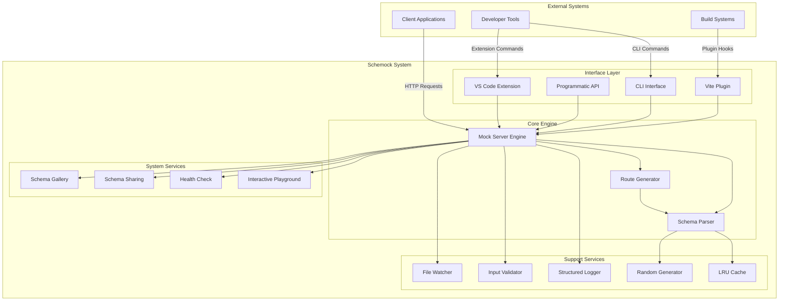
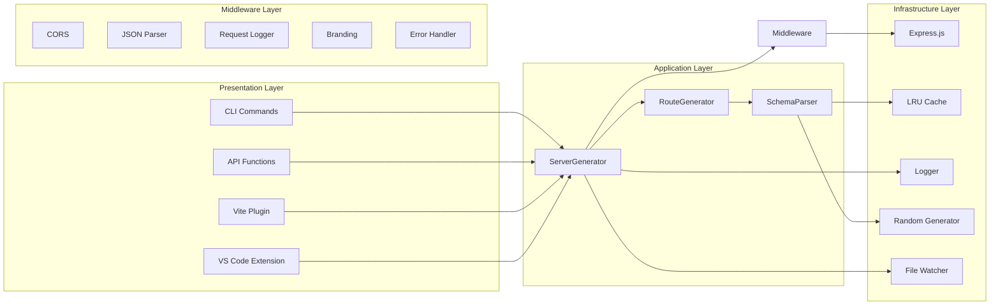
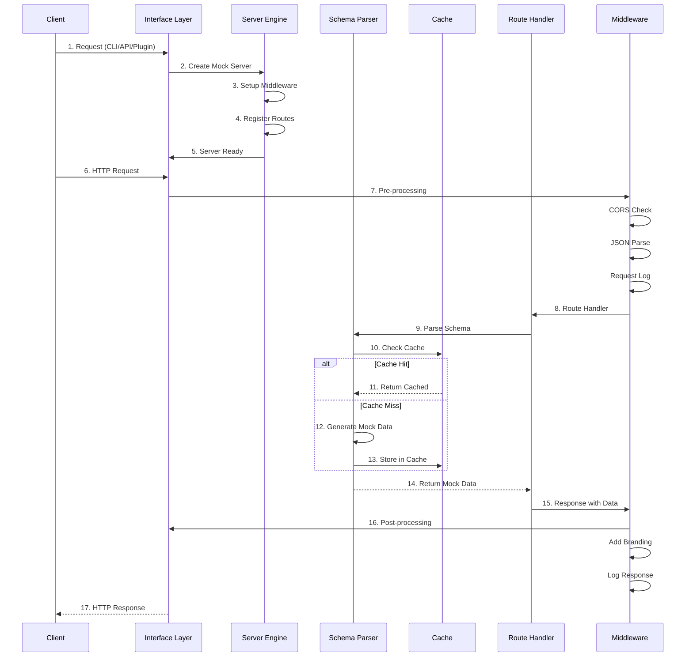
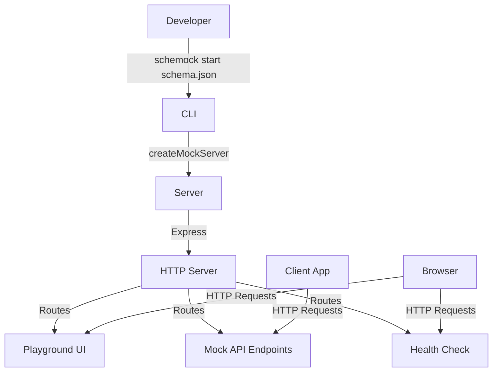
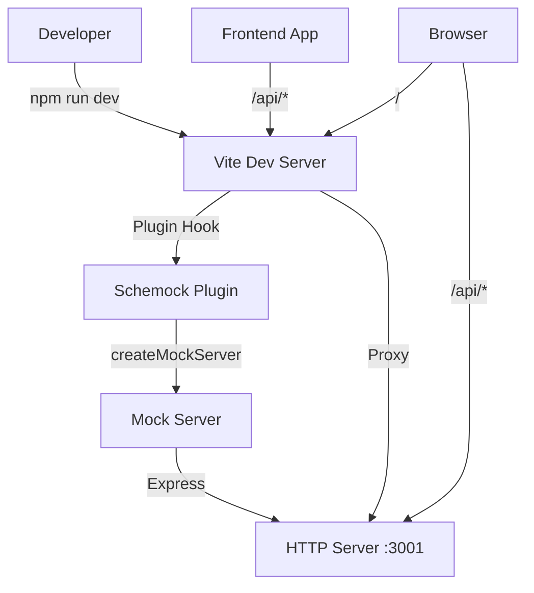
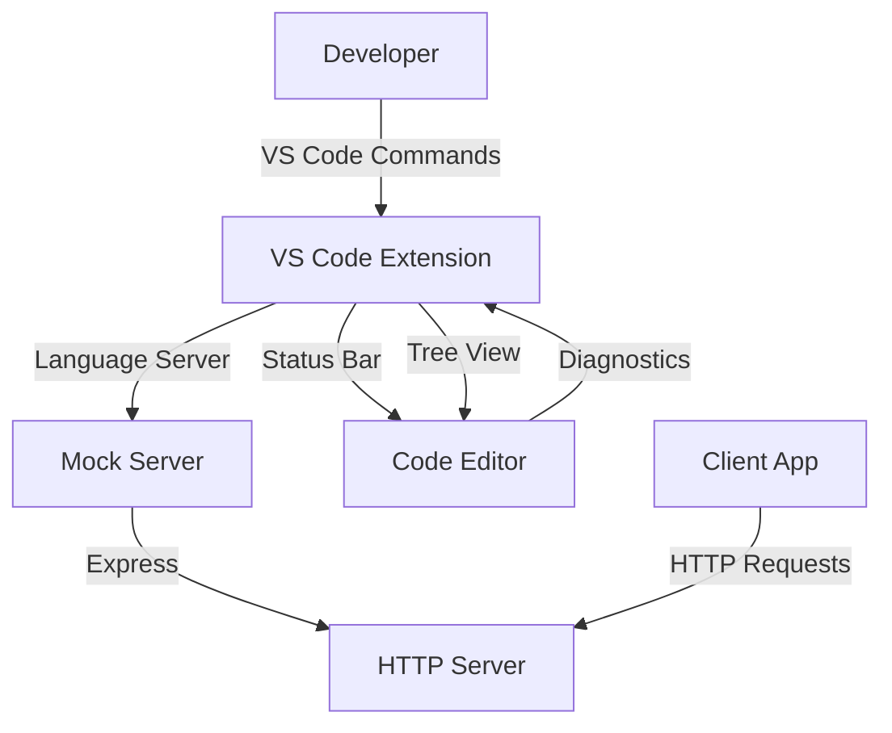
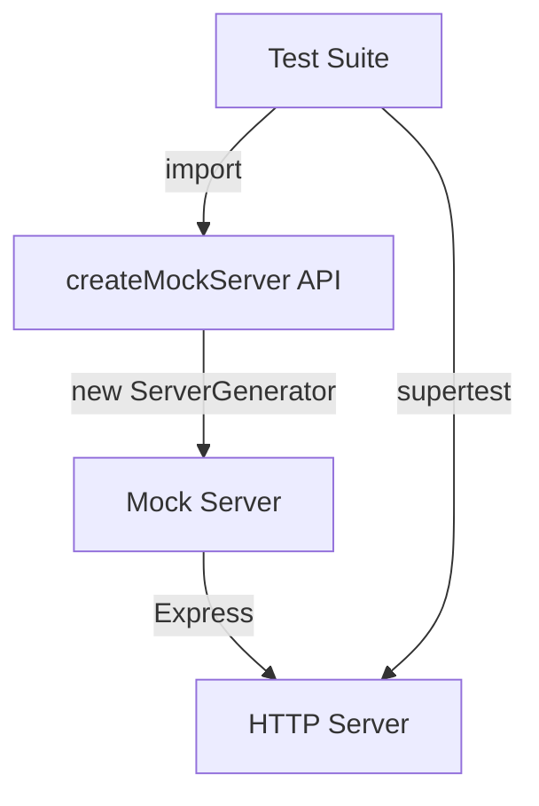

# System Overview

This document provides a high-level architectural overview of Schemock, including system boundaries, component interactions, and deployment scenarios.

## Table of Contents

- [Architecture Vision](#architecture-vision)
- [System Boundaries](#system-boundaries)
- [High-Level Architecture](#high-level-architecture)
- [Deployment Scenarios](#deployment-scenarios)
- [Technology Stack](#technology-stack)
- [Non-Functional Requirements](#non-functional-requirements)

## Architecture Vision

Schemock is designed as a **lightweight, schema-driven mock server** that enables developers to rapidly prototype and test client applications without requiring backend implementation. The architecture prioritizes:

1. **Simplicity**: Easy to understand, configure, and extend
2. **Flexibility**: Supports multiple integration points and customization
3. **Performance**: Fast mock data generation with minimal overhead
4. **Developer Experience**: Intuitive CLI and interactive playground

### Design Philosophy

- **Schema-First**: All behavior derives from JSON Schema definitions
- **Convention over Configuration**: Sensible defaults with optional overrides
- **Progressive Enhancement**: Works with basic schemas, advanced features optional
- **Test-Friendly**: Deterministic behavior with seeded random generation

## System Boundaries

### Interface Layer

The **Interface Layer** provides multiple entry points for interacting with Schemock:

| Interface | Description | Use Case |
|-----------|-------------|-----------|
| **CLI** | Command-line interface via Commander.js | Quick server startup, project initialization |
| **Programmatic API** | TypeScript/JavaScript API | Integration with test suites, custom servers |
| **Vite Plugin** | Vite build plugin | Development server integration for frontend projects |
| **VS Code Extension** | VS Code language server | In-IDE mock server management |

### Core Engine

The **Core Engine** contains the primary business logic:

| Component | Description | Key Responsibilities |
|-----------|-------------|---------------------|
| **Mock Server Engine** | Express.js-based HTTP server | Request handling, route registration, lifecycle management |
| **Schema Parser** | JSON Schema interpreter | Mock data generation, schema validation |
| **Route Generator** | Route configuration builder | CRUD route creation, custom route handling |

### Support Services

The **Support Services** provide cross-cutting functionality:

| Component | Description | Key Responsibilities |
|-----------|-------------|---------------------|
| **LRU Cache** | Least-recently-used cache | Schema parsing result caching |
| **Structured Logger** | Hierarchical logging | Request logging, debug output, error tracking |
| **Input Validator** | Configuration validation | Port validation, schema validation, path sanitization |
| **Random Generator** | Seeded random number generator | Deterministic mock data, reproducible tests |
| **File Watcher** | Chokidar-based file watcher | Schema hot-reload, change detection |

### System Services

The **System Services** provide built-in endpoints for development:

| Service | Description | Purpose |
|----------|-------------|---------|
| **Interactive Playground** | Browser-based API explorer | Test endpoints, view schemas, try requests |
| **Health Check** | Server status endpoint | Monitoring, uptime tracking |
| **Schema Sharing** | Configuration export | Share mock API configuration |
| **Schema Gallery** | Example schemas | Learning resources, quick starts |

## High-Level Architecture

### Layered Architecture

### Component Interaction Flow

## Deployment Scenarios

### Scenario 1: CLI-Based Mock Server

**Use Case**: Developer wants to quickly start a mock server from a schema file

**Flow**:

1. Developer runs `schemock start schema.json`
2. CLI validates schema and creates server
3. Server starts on configured port (default 3000)
4. Client apps can now make requests to mock endpoints
5. Developer can use playground to test endpoints

### Scenario 2: Vite Integration

**Use Case**: Frontend developer wants mock API alongside Vite dev server

**Flow**:

1. Developer installs `schemock` and configures Vite plugin
2. Vite starts dev server and calls plugin's `configureServer` hook
3. Plugin creates mock server on port 3001
4. Plugin configures Vite to proxy `/api/*` requests to mock server
5. Frontend can now make API calls that go through Vite to mock server

### Scenario 3: VS Code Integration

**Use Case**: Developer wants to manage mock server from within VS Code

**Flow**:

1. Developer installs Schemock VS Code extension
2. Extension provides commands to start/stop server
3. Extension shows server status in status bar
4. Extension provides tree view of available routes
5. Developer can start server with single click from editor

### Scenario 4: Programmatic API

**Use Case**: Developer wants to test against mock server in automated tests

**Flow**:

1. Test suite imports `createMockServer` from schemock
2. Test creates server instance with test schema
3. Test uses `supertest` to make HTTP requests
4. Server returns mock data based on schema
5. Test asserts on response structure and values

## Technology Stack

### Core Technologies

| Technology | Version | Purpose | Justification |
|-----------|----------|---------|---------------|
| **Node.js** | 18+ | JavaScript runtime | LTS stability, async I/O, widespread adoption |
| **TypeScript** | 5.x | Type system | Compile-time safety, better IDE support |
| **Express.js** | 4.x | Web framework | Mature ecosystem, middleware support, simplicity |

### Key Dependencies

| Dependency | Purpose | Key Features Used |
|-----------|---------|-------------------|
| **commander** | CLI framework | Command parsing, help generation |
| **cors** | CORS middleware | Cross-origin request handling |
| **chalk** | Terminal colors | Colored console output |
| **uuid** | UUID generation | Unique ID generation for mock data |
| **chokidar** | File watching | Schema hot-reload capability |

### Development Tools

| Tool | Purpose |
|------|---------|
| **Jest** | Unit and integration testing |
| **ESLint** | Code linting and style |
| **Prettier** | Code formatting |
| **pkg** | Executable packaging |

## Non-Functional Requirements

### Performance

| Requirement | Target | Implementation |
|-------------|---------|----------------|
| **Startup Time** | < 1 second | Lazy initialization, minimal dependencies |
| **Response Time** | < 10ms (mock data) | Efficient parsing, LRU caching |
| **Memory Usage** | < 50MB (idle) | In-memory state, cache size limits |
| **Throughput** | > 1000 req/sec | Non-blocking I/O, connection pooling |

### Reliability

| Requirement | Implementation |
|-------------|----------------|
| **Graceful Shutdown** | Connection tracking, SIGINT handling |
| **Error Recovery** | Try-catch in route handlers, error middleware |
| **Connection Limits** | Express default limits, configurable body size |
| **Port Conflict Detection** | EADDRINUSE error handling with helpful messages |

### Scalability

| Aspect | Approach |
|---------|-----------|
| **Horizontal Scaling** | Stateless design enables multiple instances |
| **Vertical Scaling** | Efficient algorithms, minimal memory footprint |
| **Cache Scaling** | Configurable LRU cache size and TTL |

### Security

| Concern | Mitigation |
|----------|-------------|
| **Prototype Pollution** | Safe merge implementation, dangerous key filtering |
| **Directory Traversal** | Path validation, absolute path rejection |
| **Executable Execution** | Extension blocking, null byte removal |
| **Input Validation** | Schema validation, port range checking |
| **CORS Configuration** | User-configurable, defaults to enabled |

### Maintainability

| Aspect | Implementation |
|---------|----------------|
| **Code Organization** | Modular structure, clear separation of concerns |
| **Type Safety** | Full TypeScript coverage, strict mode |
| **Testing** | Comprehensive unit and integration tests |
| **Documentation** | Inline comments, architecture docs, API docs |
| **Error Messages** | Helpful hints, error codes, field-specific details |

### Extensibility

| Extension Point | Description |
|----------------|-------------|
| **Custom Routes** | Function-based responses for dynamic behavior |
| **Middleware** | Access to Express app for custom middleware |
| **Schema Extensions** | `x-schemock-routes` for custom route definitions |
| **Response Types** | Static, dynamic, or schema-based responses |
| **Plugins** | Vite plugin architecture for build integration |

---

**Related Documents**:

- [Component Architecture](./02-component-architecture.md) - Detailed component breakdown
- [Data Flow](./03-data-flow.md) - Complete request lifecycle
- [Design Patterns](./04-design-patterns.md) - Patterns used in codebase

**Last Updated**: 2026-01-09
