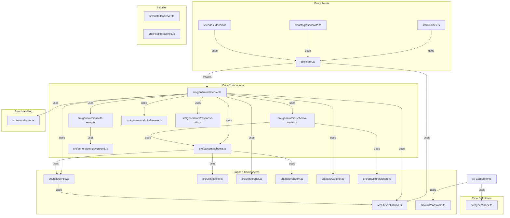
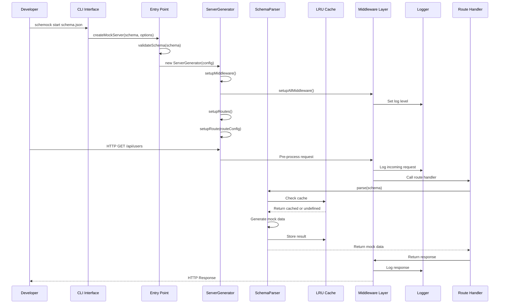
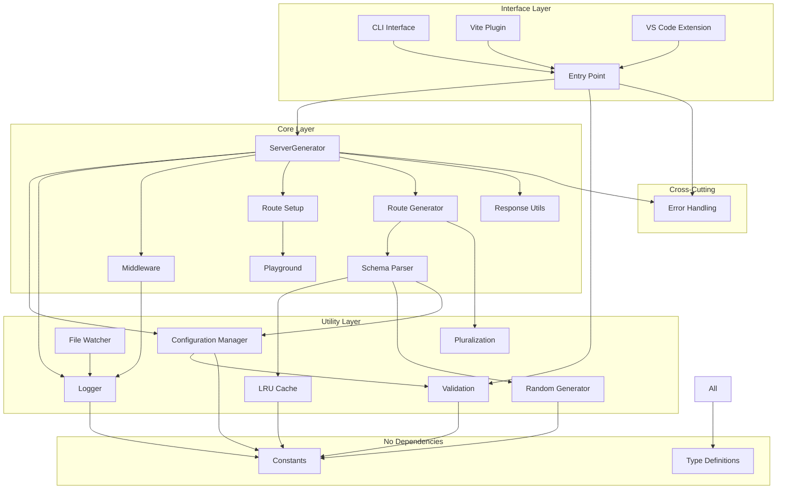

# Component Architecture

This document provides a detailed breakdown of all components in Schemock, their responsibilities, interfaces, and interactions.

## Table of Contents

- [Component Overview](#component-overview)
- [Core Components](#core-components)
- [Support Components](#support-components)
- [System Components](#system-components)
- [Component Interactions](#component-interactions)
- [Component Dependencies](#component-dependencies)

## Component Overview



## Core Components

### 1. ServerGenerator

**Location**: [`src/generators/server.ts`](../src/generators/server.ts:1)

**Purpose**: Manages the lifecycle of mock HTTP servers and route registration.

**Key Responsibilities**:

- Initialize Express application with middleware
- Register routes based on configuration
- Handle server lifecycle (start, stop, restart)
- Manage active connections for graceful shutdown
- Apply scenario-based behavior (delays, errors)
- Handle request validation in strict mode

**Public Interface**:

```typescript
class ServerGenerator {
  constructor(config: MockServerConfig, skipValidation?: boolean)
  start(): Promise<void>
  stop(): Promise<void>
  restart(newConfig?: MockServerConfig): Promise<void>
  isRunning(): boolean
  getApp(): Application
  getConfig(): MockServerConfig
  static generateFromSchema(schema: Schema, options?: ServerOptions): ServerGenerator
}
```

**Internal Methods**:

- `setupMiddleware()`: Configures all middleware
- `setupRoutes()`: Registers all routes
- `setupRoute(routeConfig)`: Registers a single route

**State**:

- `app: Application` - Express application instance
- `config: MockServerConfig` - Server configuration
- `server: Server | null` - HTTP server instance
- `state: ServerState` - In-memory resource state
- `connections: Set<unknown>` - Active connections
- `isStopping: boolean` - Shutdown flag
- `skipValidation: boolean` - Validation flag

**Dependencies**:

- Express.js (HTTP server)
- [`Middleware`](#5-middleware) (request processing)
- [`RouteSetup`](#4-route-setup) (system routes)
- [`Logger`](#2-logger) (logging)
- [`Config`](#1-configuration-manager) (validation)
- [`Errors`](#error-handling) (error types)

**ADR-001: ServerGenerator as Central Orchestrator**
**Decision**: ServerGenerator is the central component that orchestrates all other components.

**Rationale**:

- Single entry point for server lifecycle
- Clear ownership of Express application
- Simplifies testing and mocking
- Easier to add new features

### 2. SchemaParser

**Location**: [`src/parsers/schema.ts`](../src/parsers/schema.ts:1)

**Purpose**: Generates mock data from JSON Schema definitions.

**Key Responsibilities**:

- Parse JSON Schema structures
- Generate mock data for all schema types
- Handle schema composition (oneOf, anyOf, allOf)
- Resolve schema references ($ref)
- Apply heuristics for realistic data
- Cache parsing results for performance

**Public Interface**:

```typescript
class SchemaParser {
  static parse(schema: Schema, rootSchema?: Schema, visited?: Set<string>,
             strict?: boolean, propertyName?: string, useCache?: boolean): NonNullJSONValue
  static clearCache(): void
  static getCacheStats(): CacheStats
  static initRandomGenerator(seed?: number): void
  static resetRandomGenerator(): void
}
```

**Internal Methods**:

- `parseByType()`: Delegates to type-specific generators
- `resolveRef()`: Resolves $ref references
- `generateString()`: Generates string values with heuristics
- `generateNumber()`: Generates numeric values with constraints
- `generateBoolean()`: Generates random boolean
- `generateArray()`: Generates arrays with item schemas
- `generateObject()`: Generates objects with properties

**State**:

- `schemaCache: LRUCache<JSONValue>` - Singleton cache for parsed schemas

**Dependencies**:

- [`Cache`](#3-lru-cache) (parsing result caching)
- [`Random`](#4-random-generator) (data generation)
- [`Config`](#1-configuration-manager) (safe merge)

**ADR-002: SchemaParser with Heuristics**
**Decision**: SchemaParser uses property name heuristics for realistic mock data.

**Rationale**:

- More useful mock data for testing
- No additional configuration required
- Improves developer experience
- Can be disabled with custom schemas

**ADR-003: LRU Cache for Schema Parsing**
**Decision**: SchemaParser uses LRU cache for parsing results.

**Rationale**:

- Schema parsing is expensive operation
- Same schemas used repeatedly
- LRU automatically evicts unused entries
- Configurable TTL for freshness

### 3. RouteGenerator

**Location**: [`src/generators/schema-routes.ts`](../src/generators/schema-routes.ts:1)

**Purpose**: Generates route configurations from schemas.

**Key Responsibilities**:

- Determine resource names from schemas
- Generate CRUD routes automatically
- Generate custom routes from x-schemock-routes
- Create route handlers with state management
- Handle different HTTP methods appropriately

**Public Interface**:

```typescript
function determineResourceName(schema: Schema, options: { resourceName?: string }): string
function determineBasePath(resourceName: string, options: { basePath?: string }): string
function createRouteHandler(method: string, routePath: string, routeDef: object,
                          mainSchema: Schema, options: { strict?: boolean },
                          wrap?: boolean): (req: RouteRequest, state: ServerState) => JSONValue
function generateCustomRoutes(schema: Schema, createHandler: Function): Record<string, RouteConfig>
function generateCrudRoutes(basePath: string, schema: Schema, createHandler: Function): Record<string, RouteConfig>
```

**Internal Functions**:

- `handleGetById()`: Handles GET by ID requests
- `handleGetCollection()`: Handles GET collection requests
- `handlePost()`: Handles POST create requests
- `handlePut()`: Handles PUT update requests
- `handleDelete()`: Handles DELETE remove requests
- `initializeResourceState()`: Initializes state for a resource

**Dependencies**:

- [`SchemaParser`](#2-schemaparser) (mock data generation)
- [`Types`](#type-definitions) (type definitions)

**ADR-004: Factory Pattern for Route Handlers**
**Decision**: RouteGenerator uses factory pattern to create route handlers.

**Rationale**:

- Consistent handler creation
- Easy to add new route types
- Testable in isolation
- Separates handler logic from registration

### 4. RouteSetup

**Location**: [`src/generators/route-setup.ts`](../src/generators/route-setup.ts:1)

**Purpose**: Sets up system routes (playground, health, share, gallery).

**Key Responsibilities**:

- Configure playground route with HTML generation
- Configure health check endpoint
- Configure schema sharing endpoint
- Configure schema gallery endpoint
- Configure 404 handler
- Configure favicon handler

**Public Interface**:

```typescript
function setupPlaygroundRoute(app: Application, routes: Record<string, RouteConfig>): void
function setupHealthCheckRoute(app: Application): void
function setupShareRoute(app: Application, config: MockServerConfig, version: string): void
function setupGalleryRoute(app: Application, version: string): void
function setupFaviconRoute(app: Application): void
function setupNotFoundRoute(app: Application): void
function setupSystemRoutes(app: Application, config: MockServerConfig, version: string): void
```

**Dependencies**:

- [`Playground`](#7-playground) (HTML generation)
- [`Logger`](#2-logger) (logging)
- [`Types`](#type-definitions) (type definitions)

### 5. Middleware

**Location**: [`src/generators/middleware.ts`](../src/generators/middleware.ts:1)

**Purpose**: Provides cross-cutting request/response processing.

**Key Responsibilities**:

- Configure CORS headers
- Parse JSON request bodies
- Add branding headers
- Log incoming requests
- Handle errors gracefully

**Public Interface**:

```typescript
interface MiddlewareOptions {
  cors?: boolean;
  hideBranding?: boolean;
  logLevel?: string;
  version: string;
}

function setupCors(app: Application, enabled: boolean): void
function setupJsonParser(app: Application): void
function setupBrandingHeaders(app: Application, options: MiddlewareOptions): void
function setupRequestLogging(app: Application): void
function setupErrorHandler(app: Application, logLevel?: string): void
function setupAllMiddleware(app: Application, options: MiddlewareOptions): void
```

**Middleware Order**:

1. CORS (if enabled)
2. JSON Parser
3. Branding Headers
4. Request Logging
5. Error Handler (last)

**Dependencies**:

- Express.js (middleware functions)
- [`Logger`](#2-logger) (logging)

**ADR-005: Middleware Pipeline Pattern**
**Decision**: Middleware is applied in a specific order for consistent behavior.

**Rationale**:

- CORS must come first for pre-flight requests
- JSON parser needed before route handlers
- Logging captures all requests
- Error handler catches all errors

### 6. ResponseUtils

**Location**: [`src/generators/response-utils.ts`](../src/generators/response-utils.ts:1)

**Purpose**: Adds branding metadata to responses.

**Key Responsibilities**:

- Add _meta metadata to responses
- Skip branding when disabled
- Preserve existing metadata

**Public Interface**:

```typescript
function addBranding(data: unknown, hideBranding: boolean, version: string): unknown
```

**Dependencies**:

- None (pure function)

### 7. Playground

**Location**: [`src/generators/playground.ts`](../src/generators/playground.ts:1)

**Purpose**: Generates interactive HTML playground for API testing.

**Key Responsibilities**:

- Generate HTML with route cards
- Include schema and example response tabs
- Provide "Try it out" functionality
- Generate example responses from schemas

**Public Interface**:

```typescript
function getPlaygroundHTML(routes: Record<string, RouteConfig>): string
```

**Dependencies**:

- [`SchemaParser`](#2-schemaparser) (example generation)
- [`Types`](#type-definitions) (type definitions)

## Support Components

### 1. Configuration Manager

**Location**: [`src/utils/config.ts`](../src/utils/config.ts:1)

**Purpose**: Centralizes configuration validation and management.

**Key Responsibilities**:

- Validate server options
- Validate route configurations
- Provide default values
- Merge configurations safely
- Prevent prototype pollution

**Public Interface**:

```typescript
function safeMerge<T>(target: T, source: Record<string, unknown>): T
function validateServerOptions(options: Partial<ServerOptions>): ServerOptions
function validateRouteConfig(routeId: string, route: RouteConfig): void
function validateMockServerConfig(config: MockServerConfig): MockServerConfig
function getDefaultServerOptions(): ServerOptions
function createConfig(partialConfig: Partial<MockServerConfig>): MockServerConfig
function mergeConfigs(base: MockServerConfig, override: Partial<MockServerConfig>): MockServerConfig
```

**Validation Rules**:

- Port: 1-65535, integer
- basePath: string, starts with /
- logLevel: error, warn, info, debug
- scenario: happy-path, slow, error-heavy, sad-path
- route.path: string, starts with /
- route.statusCode: 100-599, integer
- route.delay: non-negative integer

**ADR-006: Safe Merge for Configuration**
**Decision**: Configuration uses safe merge to prevent prototype pollution.

**Rationale**:

- Security: Prevents malicious configuration
- Reliability: Avoids unexpected behavior
- Compatibility: Maintains backward compatibility

### 2. Logger

**Location**: [`src/utils/logger.ts`](../src/utils/logger.ts:1)

**Purpose**: Provides structured logging with multiple levels.

**Key Responsibilities**:

- Log messages with timestamps
- Support multiple log levels
- Colorize output for readability
- Log HTTP requests
- Log performance metrics
- Log security events

**Public Interface**:

```typescript
type LogLevel = 'error' | 'warn' | 'info' | 'debug';

interface LogContext {
  module?: string;
  operation?: string;
  [key: string]: any;
}

class Logger {
  setLevel(level: LogLevel): void
  getLevel(): LogLevel
  error(message: string, context?: LogContext): void
  warn(message: string, context?: LogContext): void
  info(message: string, context?: LogContext): void
  debug(message: string, context?: LogContext): void
  logRequest(method: string, path: string, statusCode?: number, duration?: number): void
  logPerformance(operation: string, duration: number, context?: LogContext): void
  logSecurity(message: string, context?: LogContext): void
}

const logger = new Logger();
const log = {
  error, warn, info, debug, request, performance, security
};
const setLogLevel = (level: LogLevel) => logger.setLevel(level);
```

**Log Levels**:

- `error` (0): Only errors
- `warn` (1): Errors and warnings
- `info` (2): Errors, warnings, and info
- `debug` (3): All messages

**ADR-007: Singleton Logger Pattern**
**Decision**: Logger is implemented as a singleton.

**Rationale**:

- Single logging configuration across application
- Consistent log format
- Easy to control log level globally
- No need to pass logger around

### 3. LRU Cache

**Location**: [`src/utils/cache.ts`](../src/utils/cache.ts:1)

**Purpose**: Provides least-recently-used caching with TTL.

**Key Responsibilities**:

- Store key-value pairs
- Evict least-recently-used entries
- Support TTL (time-to-live)
- Provide cache statistics

**Public Interface**:

```typescript
interface CacheOptions {
  maxSize: number;
  ttl?: number;
}

class LRUCache<T> {
  constructor(options: CacheOptions)
  get(key: string): T | undefined
  set(key: string, value: T): void
  delete(key: string): boolean
  clear(): void
  getStats(): { size: number, maxSize: number, hasTTL: boolean }
  has(key: string): boolean
}

function createSchemaHash(schema: any): string
function createCacheKey(schema: any, options?: object): string
```

**Cache Structure**:

- Doubly-linked list for LRU tracking
- Map for O(1) key lookup
- Timestamp for TTL checking

**ADR-008: Doubly-Linked List for LRU**
**Decision**: LRU cache uses doubly-linked list for tracking usage.

**Rationale**:

- O(1) move-to-front operation
- O(1) evict operation
- Minimal memory overhead
- Simple implementation

### 4. Random Generator

**Location**: [`src/utils/random.ts`](../src/utils/random.ts:1)

**Purpose**: Provides seeded random number generation for reproducible results.

**Key Responsibilities**:

- Generate random numbers with optional seed
- Support integer and float generation
- Allow reset to initial seed
- Fallback to Math.random() when unseeded

**Public Interface**:

```typescript
class SeededRandom {
  constructor(seed?: number)
  next(): number
  nextInt(min: number, max: number): number
  nextFloat(min: number, max: number): number
  reset(): void
  setSeed(seed: number): void
}

function initRandomGenerator(seed?: number): void
function resetRandomGenerator(): void
function random(): number
function randomInt(min: number, max: number): number
function randomFloat(min: number, max: number): number
```

**Algorithm**:

- Linear Congruential Generator (LCG)
- Constants from glibc for good distribution
- Formula: `current = (current * 1103515245 + 12345) & 0x7fffffff`

**ADR-009: Seeded Random for Testing**
**Decision**: Random generator supports seeding for reproducible tests.

**Rationale**:

- Deterministic test results
- Easier debugging
- Consistent mock data generation
- No external dependencies

### 5. Validation

**Location**: [`src/utils/validation.ts`](../src/utils/validation.ts:1)

**Purpose**: Validates and sanitizes user input.

**Key Responsibilities**:

- Validate port numbers
- Validate file paths (prevent directory traversal)
- Validate JSON schemas
- Validate log levels
- Validate project names
- Sanitize string inputs

**Public Interface**:

```typescript
function validatePort(port: string | number): number
function validateFilePath(filePath: string, baseDir?: string): string
function validateFileExists(filePath: string): void
function validateSchema(schema: any, strict?: boolean): void
function validateData(data: any, schema: any): void
function validateLogLevel(level: string): LogLevel
function sanitizeString(input: string, maxLength?: number): string
function validateProjectName(name: string): string
```

**Security Validations**:

- Reject absolute paths
- Reject paths with `..` (directory traversal)
- Reject paths with null bytes
- Reject executable extensions
- Reject dangerous patterns (`__proto__`, `constructor`, `prototype`)

**ADR-010: Input Validation with Helpful Messages**
**Decision**: Validation provides detailed error messages with hints.

**Rationale**:

- Better developer experience
- Faster debugging
- Clear guidance for fixes
- Reduces support burden

### 6. Watcher

**Location**: [`src/utils/watcher.ts`](../src/utils/watcher.ts:1)

**Purpose**: Provides file watching for schema hot-reload.

**Key Responsibilities**:

- Watch schema files for changes
- Emit change events
- Handle watcher errors
- Support dynamic chokidar import (ESM)
- Manage multiple watched files

**Public Interface**:

```typescript
class SchemaWatcher extends EventEmitter {
  async watch(filePath: string): Promise<void>
  unwatch(filePath: string): void
  async close(): Promise<void>
  getWatchedFiles(): string[]
  isWatching(filePath: string): boolean
}

function createWatcher(): SchemaWatcher
```

**Events**:

- `change`: Emitted when watched file changes
- `error`: Emitted when watcher encounters error

**Configuration**:

- `stabilityThreshold`: 500ms (wait for file write completion)
- `pollInterval`: 100ms (check frequency)
- `ignoreInitial`: true (skip initial scan)

**ADR-011: Dynamic ESM Import for Chokidar**
**Decision**: Watcher dynamically imports chokidar to avoid ESM issues.

**Rationale**:

- Works with both CommonJS and ESM
- Graceful degradation if unavailable
- No build-time dependency issues
- Better error handling

### 7. Constants

**Location**: [`src/utils/constants.ts`](../src/utils/constants.ts:1)

**Purpose**: Centralizes all magic numbers and strings.

**Key Responsibilities**:

- Define default values
- Define error messages
- Define configuration limits
- Define mock data templates

**Public Interface**:

```typescript
// Server defaults
export const DEFAULT_PORT = 3000;
export const DEFAULT_LOG_LEVEL = 'info';
export const DEFAULT_CORS_ENABLED = true;
export const DEFAULT_SCENARIO = 'happy-path';

// Validation limits
export const MIN_PORT = 1;
export const MAX_PORT = 65535;
export const PRIVILEGED_PORT_THRESHOLD = 1024;

// Cache settings
export const DEFAULT_CACHE_SIZE = 100;
export const CACHE_TTL = 300000; // 5 minutes

// Error codes
export const ERROR_CODES = {
  CONFIGURATION: 'E001',
  SCHEMA_PARSE: 'E100',
  SCHEMA_REF: 'E101',
  SERVER: 'E200',
  PORT: 'E201',
  FILE: 'E300',
  VALIDATION: 'E400'
};

// Error messages
export const ERROR_MESSAGES = {
  CHOKIDAR_NOT_AVAILABLE: 'Chokidar not available, file watching disabled',
  FILE_NOT_FOUND: 'File not found',
  SCHEMA_MUST_BE_OBJECT: 'Schema must be a valid object',
  // ... more messages
};
```

**ADR-012: Centralized Constants**
**Decision**: All magic numbers and strings are defined in constants file.

**Rationale**:

- Single source of truth
- Easy to change defaults
- Better code readability
- Prevents typos

### 8. Pluralization

**Location**: [`src/utils/pluralization.ts`](../src/utils/pluralization.ts:1)

**Purpose**: Provides intelligent pluralization for resource names.

**Key Responsibilities**:

- Pluralize resource names for API paths
- Handle irregular plurals
- Handle words ending in 's'

**Public Interface**:

```typescript
function smartPluralize(word: string): string
```

**Logic**:

- Check if word already ends in 's'
- Handle common irregular plurals (person -> people)
- Default to adding 's'

## System Components

### Error Handling

**Location**: [`src/errors/index.ts`](../src/errors/index.ts:1)

**Purpose**: Provides custom error classes with helpful messages.

**Key Responsibilities**:

- Define error hierarchy
- Provide error codes
- Include helpful hints
- Format error messages for display

**Public Interface**:

```typescript
class SchemockError extends Error {
  constructor(message: string, code: string, details?: any, hint?: string)
}

class ConfigurationError extends SchemockError { code: 'E001' }
class SchemaParseError extends SchemockError { code: 'E100' }
class SchemaRefError extends SchemockError { code: 'E101' }
class ServerError extends SchemockError { code: 'E200' }
class PortError extends SchemockError { code: 'E201' }
class FileError extends SchemockError { code: 'E300' }
class ValidationError extends SchemockError { code: 'E400' }

function formatError(error: Error): string
```

**Error Code Ranges**:

- E001-E099: Configuration errors
- E100-E199: Schema parsing errors
- E200-E299: Server errors
- E300-E399: File I/O errors
- E400-E499: Validation errors

### Type Definitions

**Location**: [`src/types/index.ts`](../src/types/index.ts:1)

**Purpose**: Provides TypeScript type definitions for entire codebase.

**Key Responsibilities**:

- Define JSON Schema types
- Define server configuration types
- Define route configuration types
- Provide type guards

**Public Interface**:

```typescript
type JSONSchemaType = 'string' | 'number' | 'integer' | 'boolean' | 'object' | 'array' | 'null';
type JSONValue = string | number | boolean | null | JSONObject | JSONArray;
type JSONObject = { [key: string]: JSONValue };
type JSONArray = JSONValue[];

interface Schema {
  $schema?: string;
  $ref?: string;
  title?: string;
  type?: JSONSchemaType | JSONSchemaType[];
  properties?: Record<string, Schema>;
  items?: Schema | Schema[];
  required?: string[];
  enum?: SchemaEnumValue[];
  default?: JSONValue;
  format?: string;
  minLength?: number;
  maxLength?: number;
  minimum?: number;
  maximum?: number;
  // ... more properties
  'x-schemock-routes'?: RouteDefinition[];
}

interface ServerOptions {
  port: number;
  basePath?: string;
  resourceName?: string;
  watch?: boolean;
  cors?: boolean;
  logLevel?: 'error' | 'warn' | 'info' | 'debug';
  scenario?: 'happy-path' | 'slow' | 'error-heavy' | 'sad-path';
  strict?: boolean;
  hideBranding?: boolean;
}

interface RouteConfig {
  path: string;
  method: 'get' | 'post' | 'put' | 'delete' | 'patch';
  response: RouteResponse;
  statusCode?: number;
  delay?: number;
  headers?: Record<string, string>;
  schema?: Schema;
}

type ServerState = Record<string, JSONValue[]>;
type ResponseHandler = (req: RouteRequest, state: ServerState) => JSONValue | Promise<JSONValue>;
type RouteResponse = JSONValue | Schema | ResponseHandler;

// Type guards
function isJSONValue(value: unknown): value is JSONValue
function isJSONObject(value: unknown): value is JSONObject
function isJSONArray(value: unknown): value is JSONArray
function isSchema(value: unknown): value is Schema
function isResponseHandler(value: unknown): value is ResponseHandler
function isRouteResponse(value: unknown): value is RouteResponse
```

### Installer Components

#### Installer Server

**Location**: [`src/installer/server.ts`](../src/installer/server.ts:1)

**Purpose**: Provides interactive installer UI for Schemock.

**Key Responsibilities**:

- Serve installer HTML interface
- Handle installer API requests
- Generate project files
- Provide installation feedback

#### Installer Service

**Location**: [`src/installer/service.ts`](../src/installer/service.ts:1)

**Purpose**: Provides backend services for installer.

**Key Responsibilities**:

- Generate project scaffolding
- Create configuration files
- Handle project initialization

## Component Interactions



## Component Dependencies

### Dependency Graph



### Circular Dependencies

The architecture is designed to **avoid circular dependencies**:

- **Core Layer** depends on **Utility Layer** and **Cross-Cutting**
- **Interface Layer** depends on **Core Layer**
- **Utility Layer** has no dependencies on other layers
- **Cross-Cutting** has no dependencies on other layers

This layered approach ensures:

- Clear separation of concerns
- Testable components
- Easy to understand and modify
- No circular dependency issues

---

**Related Documents**:

- [System Overview](./01-system-overview.md) - High-level architecture
- [Data Flow](./03-data-flow.md) - Request lifecycle details
- [Design Patterns](./04-design-patterns.md) - Patterns used

**Last Updated**: 2026-01-09
