# Data Flow

This document describes how data flows through the Schemock system, from initial configuration to HTTP responses.

## Table of Contents

- [Overview](#overview)
- [Initialization Flow](#initialization-flow)
- [Request Lifecycle](#request-lifecycle)
- [Schema Parsing Flow](#schema-parsing-flow)
- [Mock Data Generation Flow](#mock-data-generation-flow)
- [Response Flow](#response-flow)
- [Error Flow](#error-flow)
- [Cache Flow](#cache-flow)

## Overview

Schemock processes data through several distinct phases:

1. **Initialization**: Server creation, configuration, and route registration
2. **Request Processing**: HTTP request reception, middleware application, route matching
3. **Data Generation**: Schema parsing, mock data generation, caching
4. **Response**: Branding, logging, and HTTP response delivery

```mermaid
graph LR
    subgraph "Initialization"
        Config[Configuration]
        Server[Server Setup]
        Routes[Route Registration]
    end

    subgraph "Request Processing"
        HTTP[HTTP Request]
        Middleware[Middleware Pipeline]
        Routing[Route Matching]
    end

    subgraph "Data Generation"
        Schema[Schema Parsing]
        Cache[Cache Check]
        Generation[Data Generation]
    end

    subgraph "Response"
        Branding[Add Branding]
        Logging[Log Response]
        Response[HTTP Response]
    end

    Config --> Server
    Server --> Routes

    HTTP --> Middleware
    Middleware --> Routing
    Routing --> Schema
    Schema --> Cache
    Cache --> Generation
    Generation --> Branding
    Branding --> Logging
    Logging --> Response
```

## Initialization Flow

### Server Creation Flow

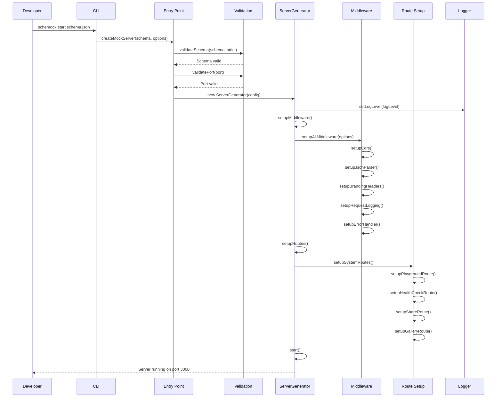

### Configuration Loading Flow

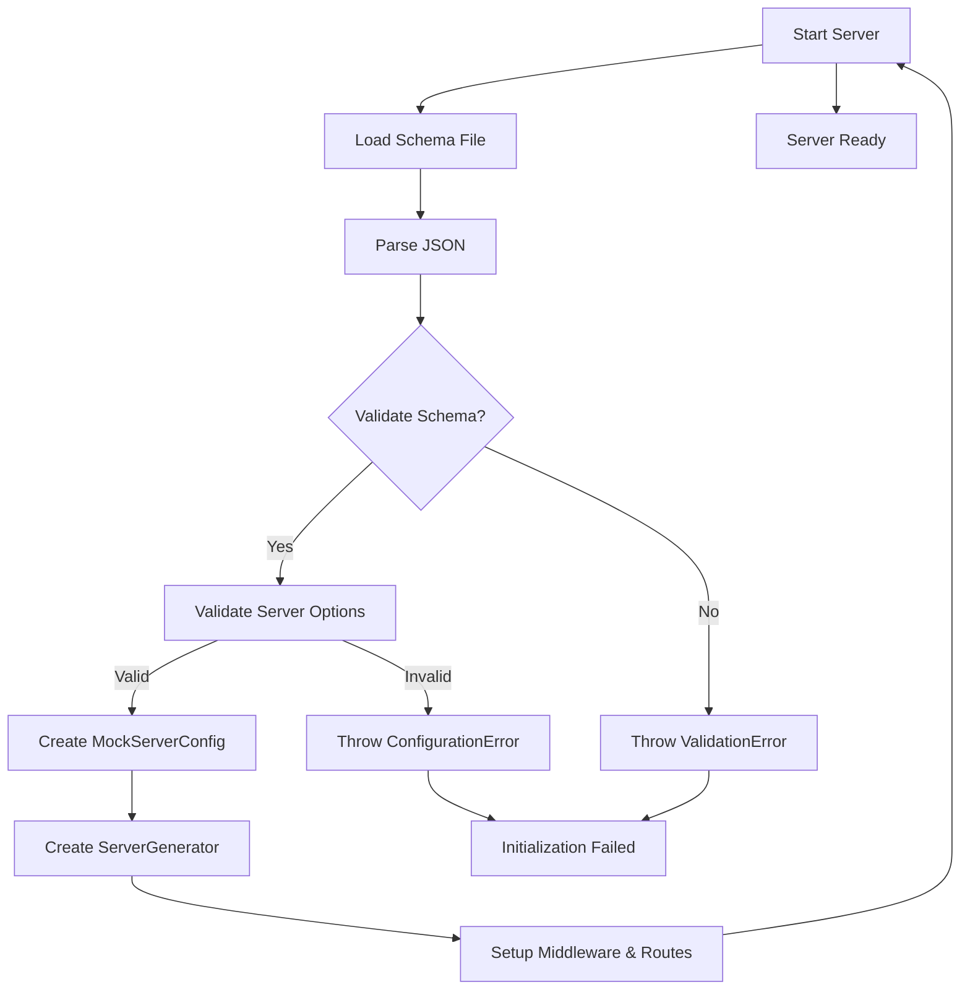

### Route Registration Flow

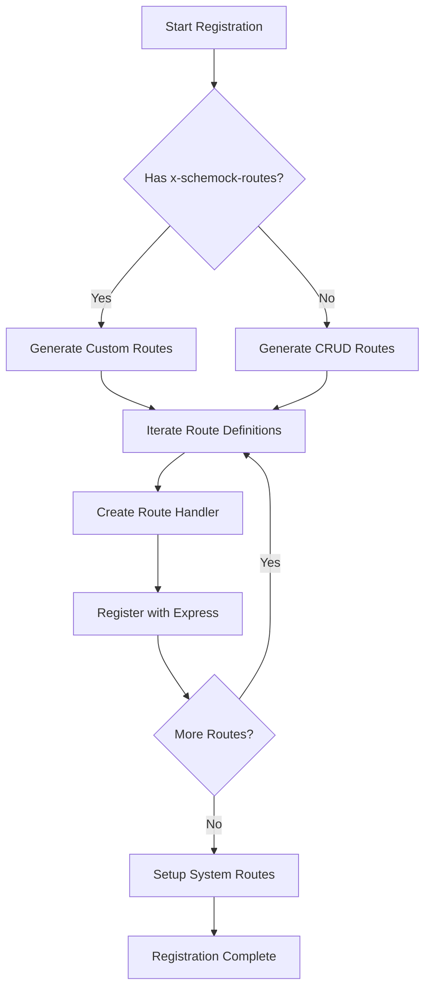

## Request Lifecycle

### HTTP Request Flow

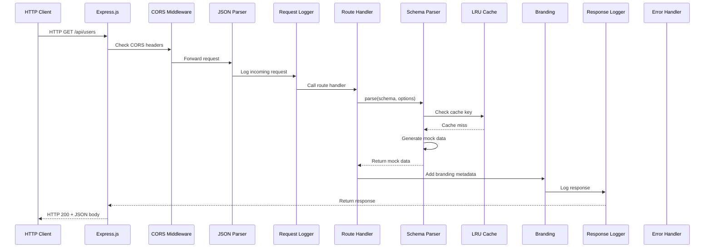

### Request Processing Pipeline

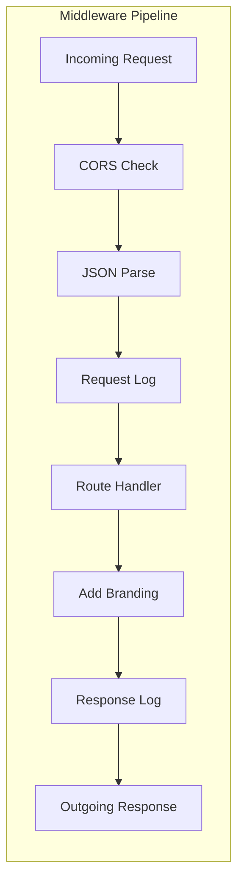

### Middleware Execution Order

| Order | Middleware | Purpose | Can Modify |
|--------|-----------|---------|-------------|
| 1 | CORS | Add CORS headers | Request, Response |
| 2 | JSON Parser | Parse request body | Request |
| 3 | Branding Headers | Add X-Powered-By header | Response |
| 4 | Request Logging | Log incoming request | None (logging only) |
| 5 | Error Handler | Catch and handle errors | Response |

**ADR-013: Middleware Order Matters**
**Decision**: Middleware is applied in a specific order for correct behavior.

**Rationale**:

- CORS must come first for pre-flight OPTIONS requests
- JSON parser needed before route handlers access body
- Request logging captures all requests before processing
- Error handler must be last to catch all errors

## Schema Parsing Flow

### Schema Parse Flow

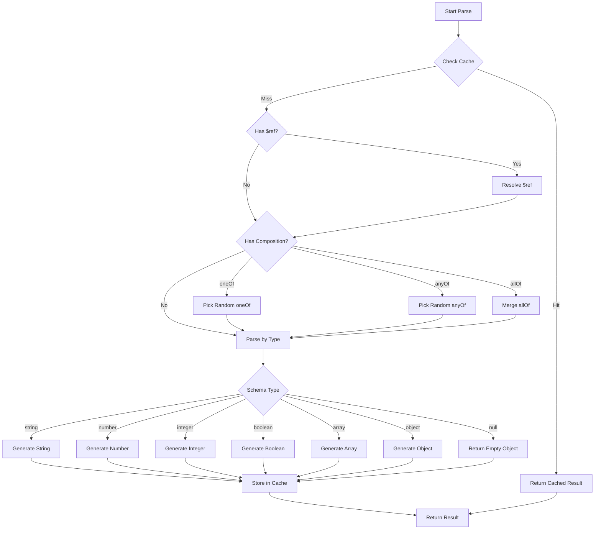

### Schema Reference Resolution

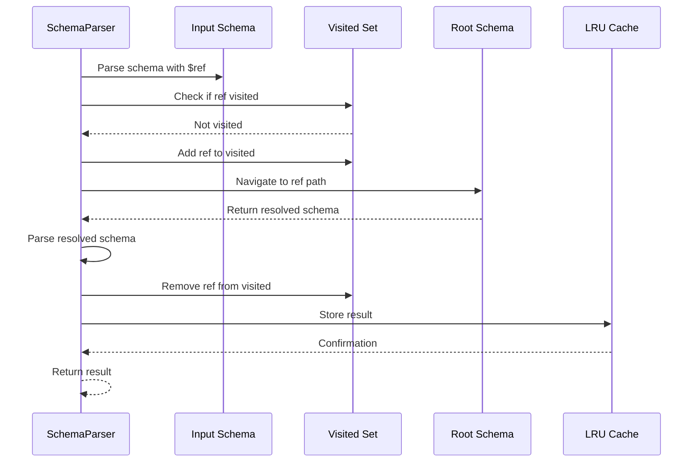

### Circular Reference Handling

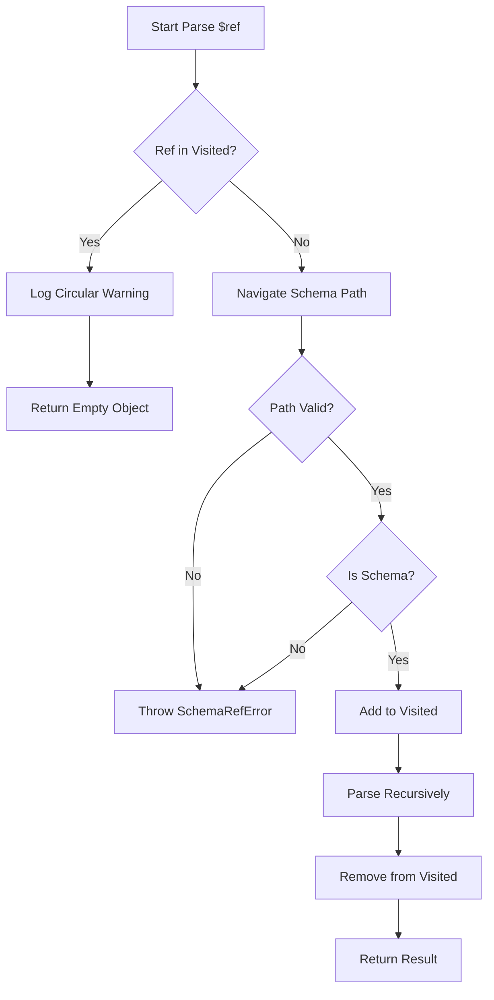

## Mock Data Generation Flow

### String Generation Flow

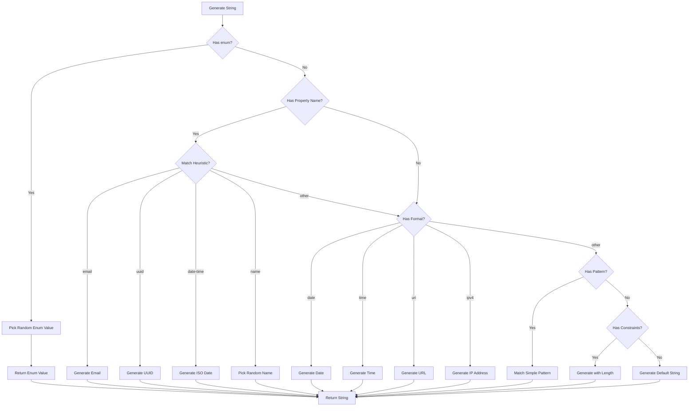

### Number Generation Flow

```mermaid
flowchart TD
    Start[Generate Number] --> CheckPropName{Has Property Name?}
    CheckPropName -->|Yes| CheckHeuristic{Match Heuristic?}
    CheckPropName -->|No| CheckConstraints{Has Constraints?}

    CheckHeuristic -->|age| Age[Generate 18-78]
    CheckHeuristic -->|price| Price[Generate 0-100]
    CheckHeuristic -->|year| Year[Generate 1970-2030]
    CheckHeuristic -->|rating| Rating[Generate 0-5]
    CheckHeuristic -->|other| CheckConstraints

    CheckConstraints -->|HasMultipleOf{Has multipleOf?}
    HasMultipleOf -->|Yes| CalcSteps[Calculate Steps]
    HasMultipleOf -->|No| CheckBounds{Has Bounds?}

    CalcSteps --> GenMultiple[Generate Multiple of Step]
    GenMultiple --> ReturnNum[Return Number]

    CheckBounds -->|Yes| ApplyBounds[Apply Min/Max]
    CheckBounds -->|No| GenDefault[Generate Default Range]

    ApplyBounds --> CheckExclusive{Has Exclusive Bounds?}
    CheckExclusive -->|Yes| AdjustExclusive[Adjust for Exclusive]
    CheckExclusive -->|No| ReturnNum
    AdjustExclusive --> ReturnNum

    Age --> ReturnNum
    Price --> ReturnNum
    Year --> ReturnNum
    Rating --> ReturnNum
    GenDefault --> ReturnNum
```

### Array Generation Flow

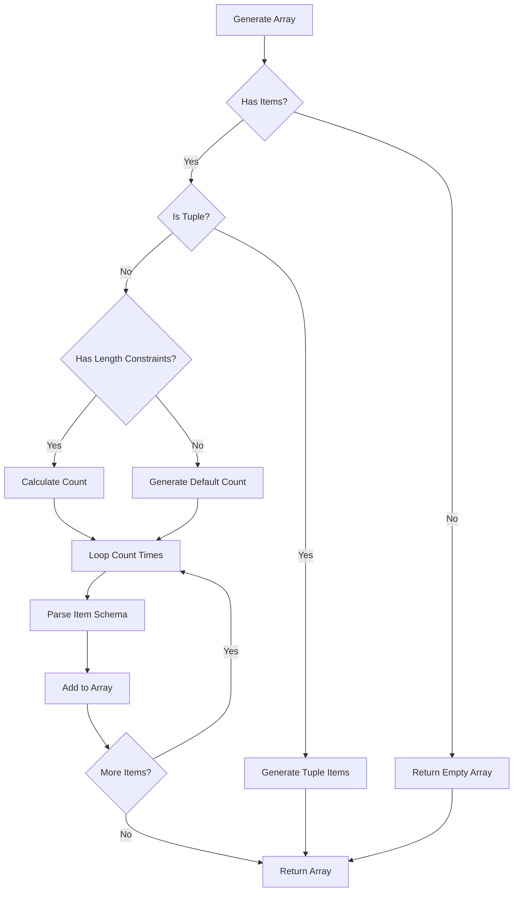

### Object Generation Flow

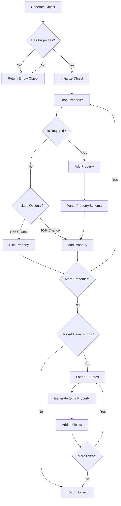

## Response Flow

### Response Preparation Flow

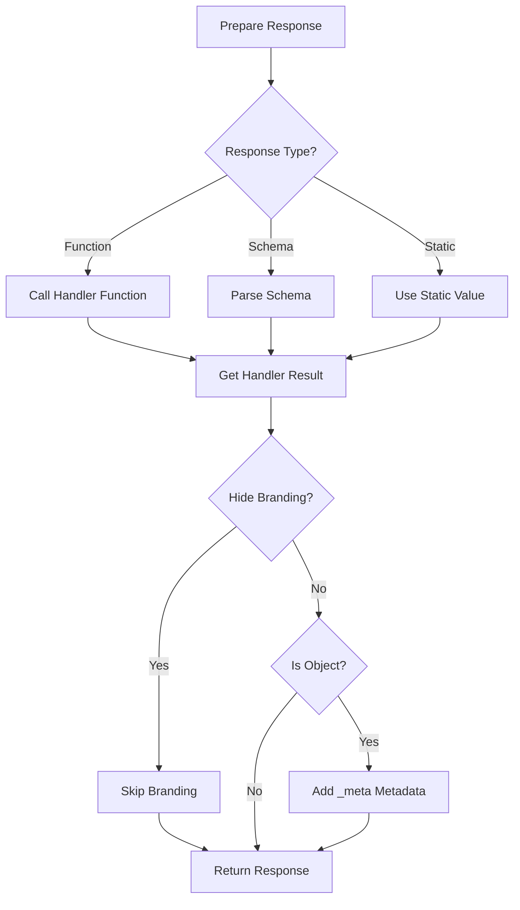

### Branding Addition Flow

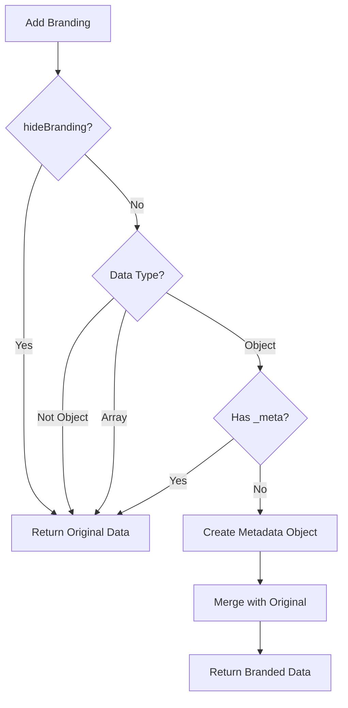

## Error Flow

### Error Handling Flow

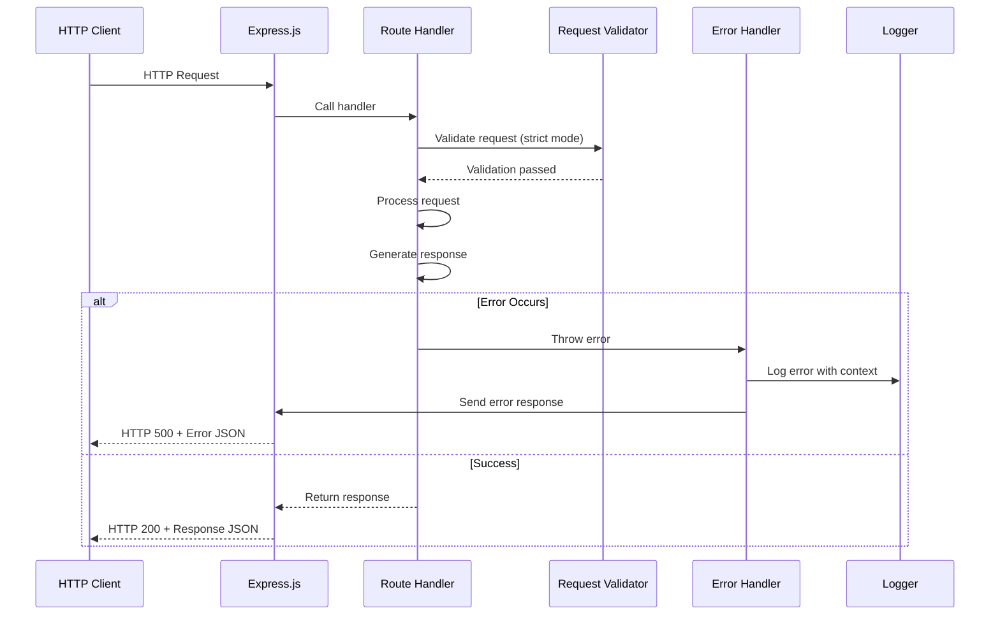

### Validation Error Flow

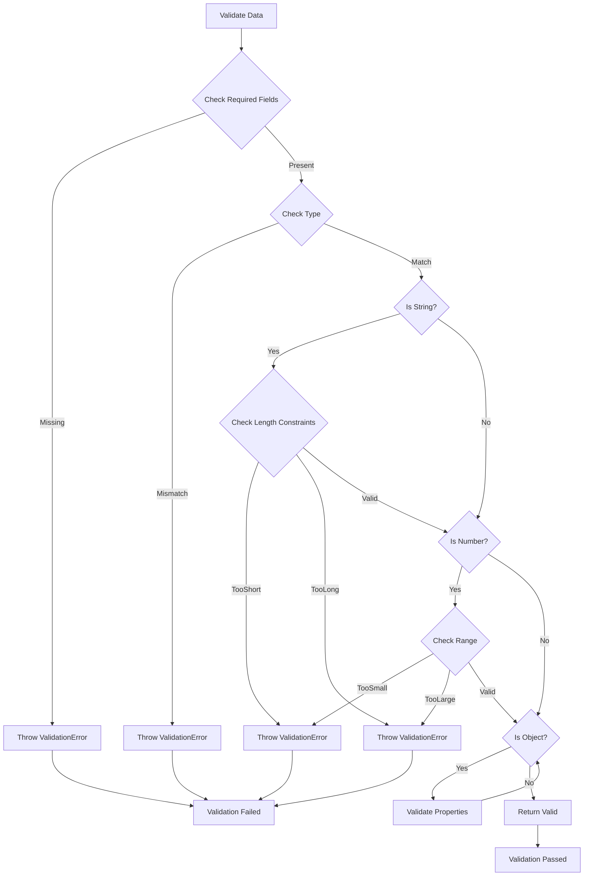

## Cache Flow

### Cache Lookup Flow

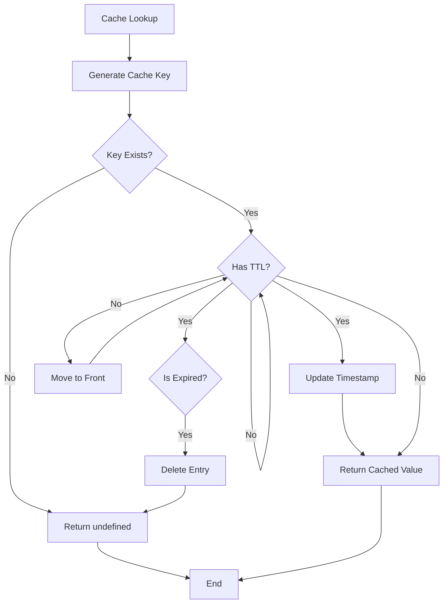

### Cache Storage Flow

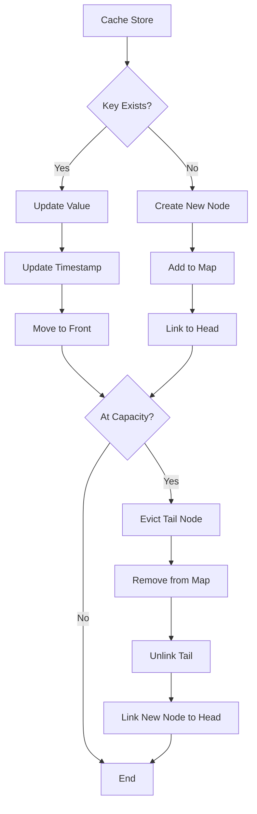

### LRU Eviction Flow

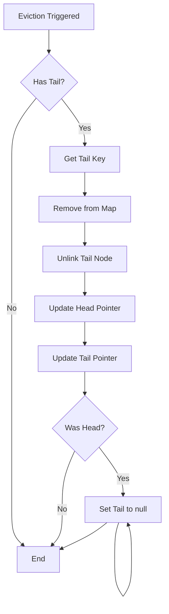

## Complete Request-Response Flow

```mermaid
sequenceDiagram
    participant Client as HTTP Client
    participant MW as Middleware
    participant Route as Route Handler
    participant Parser as Schema Parser
    participant Cache as LRU Cache
    participant State as Server State
    participant Logger as Logger

    Client->>MW: HTTP GET /api/users
    MW->>MW: CORS check
    MW->>MW: JSON parse
    MW->>MW: Log request
    MW->>Route: Call handler

    Route->>State: Get resource state
    State-->>Route: Return state array

    Route->>Parser: Parse schema
    Parser->>Cache: Check cache
    Cache-->>Parser: Cache miss
    Parser->>Parser: Generate mock data
    Parser->>Cache: Store result
    Parser-->>Route: Return data

    Route->>State: Update state (if needed)
    Route->>MW: Return response

    MW->>MW: Add branding
    MW->>MW: Log response
    MW-->>Client: HTTP 200 + JSON

    Logger->>Logger: Log complete request
```

---

**Related Documents**:

- [System Overview](./01-system-overview.md) - High-level architecture
- [Component Architecture](./02-component-architecture.md) - Component details
- [Middleware Layer](./05-middleware-layer.md) - Middleware details
- [State Management](./08-state-management.md) - State handling

**Last Updated**: 2026-01-09
