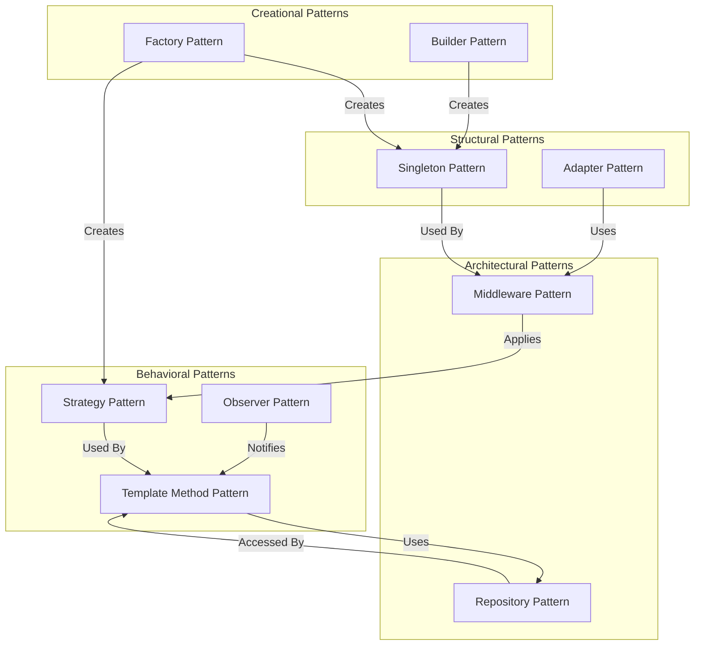

# Design Patterns

This document describes the design patterns used throughout the Schemock codebase, their implementations, and the rationale behind their use.

## Table of Contents

- [Overview](#overview)
- [Creational Patterns](#creational-patterns)
- [Structural Patterns](#structural-patterns)
- [Behavioral Patterns](#behavioral-patterns)
- [Architectural Patterns](#architectural-patterns)
- [Pattern Summary](#pattern-summary)

## Overview

Schemock employs several well-established design patterns to achieve:

- **Maintainability**: Clear separation of concerns
- **Testability**: Isolated components for unit testing
- **Extensibility**: Easy to add new features
- **Performance**: Efficient resource usage through patterns

### Pattern Categories

| Category | Patterns Used |
|-----------|---------------|
| Creational | Factory, Builder |
| Structural | Singleton, Adapter |
| Behavioral | Strategy, Observer, Template Method |
| Architectural | Middleware, Repository |

## Creational Patterns

### Factory Pattern

**Purpose**: Create objects without specifying the exact class of object that will be created.

#### Implementation: Route Handler Factory

**Location**: [`src/generators/schema-routes.ts`](../src/generators/schema-routes.ts:263)

```typescript
export function createRouteHandler(
  method: string,
  routePath: string,
  routeDef: { response?: JSONValue | Schema },
  mainSchema: Schema,
  options: { strict?: boolean },
  wrap: boolean = true
): (req: RouteRequest, state: ServerState) => JSONValue {
  return (req: RouteRequest, state: ServerState): JSONValue => {
    // Handler implementation
    const parts = routePath.split('/').filter(p => p && p !== 'api');
    const resource = parts[0] || 'data';
    // ... handler logic
  };
}
```

**Usage**:

```typescript
// Create handlers for different routes
const getHandler = createRouteHandler('get', '/api/users', { response: userSchema }, mainSchema, options);
const postHandler = createRouteHandler('post', '/api/users', { response: userSchema }, mainSchema, options);

// Register with Express
app.get('/api/users', getHandler);
app.post('/api/users', postHandler);
```

**Benefits**:

- Consistent handler creation
- Easy to add new route types
- Testable in isolation
- Encapsulates handler logic

**ADR-014: Factory Pattern for Route Handlers**
**Decision**: Use factory pattern for creating route handlers.

**Rationale**:

- Consistent handler creation across all routes
- Easy to add new route types without modifying core logic
- Simplifies testing with mock factories
- Reduces code duplication

#### Implementation: Schema Parser Factory

**Location**: [`src/parsers/schema.ts`](../src/parsers/schema.ts:76)

```typescript
export class SchemaParser {
  static parse(schema: Schema, rootSchema?: Schema, visited: Set<string> = new Set(),
             strict: boolean = false, propertyName?: string, useCache: boolean = true): NonNullJSONValue {
    // Parse implementation
    const root = rootSchema || schema;
    let result: NonNullJSONValue;

    if (schema.$ref) {
      result = this.resolveRef(schema.$ref, root, visited, strict, propertyName);
    } else {
      result = this.parseByType(schema, root, visited, strict, propertyName);
    }

    return result;
  }
}
```

**Benefits**:

- Static factory method for parsing
- No need to instantiate parser
- Consistent parsing interface
- Easy to mock for testing

### Builder Pattern

**Purpose**: Separate the construction of a complex object from its representation.

#### Implementation: Configuration Builder

**Location**: [`src/utils/config.ts`](../src/utils/config.ts:412)

```typescript
export function createConfig(partialConfig: Partial<MockServerConfig>): MockServerConfig {
  const server = validateServerOptions(partialConfig.server || {});
  const routes = partialConfig.routes || {};

  return {
    server,
    routes
  };
}

export function mergeConfigs(base: MockServerConfig, override: Partial<MockServerConfig>): MockServerConfig {
  const mergedServer = safeMerge(base.server, override.server || {});
  const mergedRoutes = safeMerge(base.routes, override.routes || {});

  return {
    server: validateServerOptions(mergedServer),
    routes: mergedRoutes
  };
}
```

**Usage**:

```typescript
// Build configuration step by step
const config = createConfig({
  server: {
    port: 3000,
    cors: true
  }
});

// Merge with overrides
const finalConfig = mergeConfigs(config, {
  server: {
    logLevel: 'debug'
  }
});
```

**Benefits**:

- Step-by-step configuration building
- Validation at each step
- Safe merging with validation
- Clear API for configuration

**ADR-015: Builder Pattern for Configuration**
**Decision**: Use builder pattern for configuration construction.

**Rationale**:

- Complex configuration with multiple options
- Need validation at each step
- Safe merging to prevent invalid states
- Clear, readable configuration code

## Structural Patterns

### Singleton Pattern

**Purpose**: Ensure a class has only one instance and provide a global point of access to it.

#### Implementation: Logger Singleton

**Location**: [`src/utils/logger.ts`](../src/utils/logger.ts:171)

```typescript
class Logger {
  private level: LogLevel = 'info';
  private readonly levels: Record<LogLevel, number> = {
    error: 0,
    warn: 1,
    info: 2,
    debug: 3
  };

  setLevel(level: LogLevel): void {
    this.level = level;
  }

  // ... other methods
}

// Export singleton instance
export const logger = new Logger();

// Export convenience functions
export const log = {
  error: (message: string, context?: LogContext) => logger.error(message, context),
  warn: (message: string, context?: LogContext) => logger.warn(message, context),
  info: (message: string, context?: LogContext) => logger.info(message, context),
  debug: (message: string, context?: LogContext) => logger.debug(message, context),
  // ... more methods
};
```

**Usage**:

```typescript
// Use the singleton instance
log.info('Server started', { port: 3000 });
log.error('Request failed', { error: err });

// Or use the logger directly
logger.setLevel('debug');
```

**Benefits**:

- Single logging configuration
- Consistent log format
- Easy to control globally
- No need to pass logger around

**ADR-016: Singleton Logger Pattern**
**Decision**: Logger implemented as a singleton.

**Rationale**:

- Single logging configuration for entire application
- Consistent log format and level
- Easy to control logging globally
- No need to pass logger instance through components

#### Implementation: LRU Cache Singleton

**Location**: [`src/parsers/schema.ts`](../src/parsers/schema.ts:9)

```typescript
// Create a singleton cache for parsed schemas
const schemaCache = new LRUCache<JSONValue>({
  maxSize: DEFAULT_CACHE_SIZE,
  ttl: CACHE_TTL
});

export class SchemaParser {
  static clearCache(): void {
    schemaCache.clear();
  }

  static getCacheStats() {
    return schemaCache.getStats();
  }

  static parse(schema: Schema, ...): NonNullJSONValue {
    // Check cache
    const cacheKey = useCache && visited.size === 0
      ? createCacheKey(schema, { strict, propertyName })
      : null;

    if (cacheKey && schemaCache.has(cacheKey)) {
      const cached = schemaCache.get(cacheKey);
      if (cached !== undefined && cached !== null) {
        return cached as NonNullJSONValue;
      }
    }

    // Parse and cache result
    const result = /* ... parsing logic ... */;
    if (cacheKey && useCache) {
      schemaCache.set(cacheKey, result);
    }

    return result;
  }
}
```

**Benefits**:

- Shared cache across all schema parsing
- Consistent caching behavior
- Easy to clear and get stats
- No need to pass cache around

### Adapter Pattern

**Purpose**: Allow incompatible interfaces to work together.

#### Implementation: Express Adapter

**Location**: [`src/generators/server.ts`](../src/generators/server.ts:72)

```typescript
export class ServerGenerator {
  private app: Application;
  private config: MockServerConfig;

  constructor(config: MockServerConfig, skipValidation: boolean = false) {
    this.config = skipValidation ? config : validateMockServerConfig(config);
    this.app = express(); // Create Express app

    this.setupMiddleware();
    this.setupRoutes();
  }

  private setupMiddleware(): void {
    setupAllMiddleware(this.app, {
      cors: this.config.server.cors,
      hideBranding: this.config.server.hideBranding,
      logLevel: this.config.server.logLevel,
      version: this.version
    });
  }

  private setupRoutes(): void {
    Object.entries(this.config.routes).forEach(([_, routeConfig]) => {
      this.setupRoute(routeConfig);
    });
    setupSystemRoutes(this.app, this.config, this.version);
  }

  public getApp(): Application {
    return this.app;
  }
}
```

**Benefits**:

- Adapts internal configuration to Express
- Encapsulates Express complexity
- Clean API for external use
- Easy to swap HTTP framework

## Behavioral Patterns

### Strategy Pattern

**Purpose**: Define a family of algorithms, encapsulate each one, and make them interchangeable.

#### Implementation: Response Type Strategy

**Location**: [`src/generators/server.ts`](../src/generators/server.ts:173)

```typescript
private setupRoute(routeConfig: RouteConfig): void {
  const routeHandler = async (req: Request, res: Response, next: NextFunction) => {
    const startTime = Date.now();
    const scenario = this.config.server.scenario;

    try {
      // Apply delay based on scenario strategy
      let effectiveDelay = delay;
      if (scenario === 'slow' || scenario === 'sad-path') {
        effectiveDelay += 1000 + Math.random() * 2000;
      }

      if (effectiveDelay > 0) {
        await new Promise(resolve => setTimeout(resolve, effectiveDelay));
      }

      // Handle different response types
      if (typeof response === 'function') {
        // Function response strategy
        const routeReq: RouteRequest = {
          params: req.params as Record<string, string> | undefined,
          query: req.query,
          body: req.body,
          method: req.method,
          path: req.path,
          headers: req.headers as Record<string, string>
        };
        const result = await Promise.resolve(response(routeReq, this.state));
        const brandedResult = addBranding(result, this.config.server.hideBranding ?? false, this.version);
        res.status(statusCode).json(brandedResult);
      } else if (typeof response === 'object' && response !== null) {
        // Static object response strategy
        const brandedResponse = addBranding(response, this.config.server.hideBranding ?? false, this.version);
        res.status(statusCode).json(brandedResponse);
      } else {
        // Other type strategy
        res.status(statusCode).send(response);
      }
    } catch (error) {
      next(error);
    }
  };
}
```

**Benefits**:

- Different response handling strategies
- Easy to add new response types
- Consistent interface for all strategies
- Scenario-based behavior

**ADR-017: Strategy Pattern for Response Types**
**Decision**: Use strategy pattern for different response types.

**Rationale**:

- Multiple response types (static, dynamic, function)
- Need different handling for each type
- Easy to add new response types
- Consistent response preparation

#### Implementation: Scenario Strategy

**Location**: [`src/generators/server.ts`](../src/generators/server.ts:111)

```typescript
// Scenario-based error strategy
if (scenario === 'error-heavy' || scenario === 'sad-path') {
  // 30% chance of returning an error
  if (Math.random() < 0.3) {
    const errorStatus = [400, 401, 403, 404, 500, 503][Math.floor(Math.random() * 6)];
    log.warn(`Scenario ${scenario} triggered error`, {
      module: 'server',
      path,
      method,
      statusCode: errorStatus
    });
    return res.status(errorStatus).json({
      success: false,
      error: 'ScenarioError',
      message: `This error was generated by the '${scenario}' preset scenario.`,
      statusCode: errorStatus
    });
  }
}
```

**Benefits**:

- Pluggable scenario behavior
- Easy to add new scenarios
- Consistent error generation
- Testable scenario logic

### Observer Pattern

**Purpose**: Define a one-to-many dependency between objects so that when one object changes state, all dependents are notified.

#### Implementation: File Watcher Observer

**Location**: [`src/utils/watcher.ts`](../src/utils/watcher.ts:31)

```typescript
export class SchemaWatcher extends EventEmitter {
  private watcher: any | null = null;
  private watchedFiles: Set<string> = new Set();

  async watch(filePath: string): Promise<void> {
    if (this.watchedFiles.has(filePath)) {
      return;
    }

    const chokidar = await getChokidar();
    if (!chokidar) {
      return;
    }

    if (!this.watcher) {
      this.watcher = chokidar.watch([], {
        persistent: true,
        ignoreInitial: true,
        awaitWriteFinish: {
          stabilityThreshold: WATCHER_STABILITY_THRESHOLD,
          pollInterval: WATCHER_POLL_INTERVAL
        }
      });

      // Register observers
      this.watcher
        .on('change', (path: string) => {
          log.info(`Schema file changed`, {
            module: 'watcher',
            filePath: path
          });
          this.emit('change', path); // Notify observers
        })
        .on('error', (error: unknown) => {
          const errorMessage = error instanceof Error ? error.message : String(error);
          log.error(`${ERROR_MESSAGES.FILE_WATCHER_ERROR}: ${errorMessage}`, {
            module: 'watcher',
            error: error instanceof Error ? error : new Error(errorMessage),
            filePath
          });
          this.emit('error', new FileError(
            `${ERROR_MESSAGES.FILE_WATCHER_ERROR}: ${errorMessage}`,
            filePath,
            'watch'
          )); // Notify observers
        });
    }

    this.watcher.add(filePath);
    this.watchedFiles.add(filePath);
  }
}
```

**Usage**:

```typescript
// Create watcher
const watcher = new SchemaWatcher();

// Register observers
watcher.on('change', async (changedPath: string) => {
  console.log('Schema changed, reloading...');
  await reloadSchema(changedPath);
});

watcher.on('error', (error: Error) => {
  console.error('Watcher error:', error);
});

// Start watching
await watcher.watch('./schema.json');
```

**Benefits**:

- Loose coupling between watcher and consumers
- Multiple observers for same event
- Easy to add new event handlers
- Clean event-driven architecture

**ADR-018: Observer Pattern for File Watching**
**Decision**: Use observer pattern for file watching events.

**Rationale**:

- Multiple consumers need file change notifications
- Loose coupling between watcher and consumers
- Easy to add new event handlers
- Event-driven architecture for hot-reload

### Template Method Pattern

**Purpose**: Define the skeleton of an algorithm in an operation, deferring some steps to subclasses.

#### Implementation: Route Handler Template

**Location**: [`src/generators/schema-routes.ts`](../src/generators/schema-routes.ts:76)

```typescript
// Template for GET by ID handler
function handleGetById(
  state: ServerState,
  resource: string,
  req: RouteRequest,
  responseSchema: Schema,
  mainSchema: Schema,
  options: { strict?: boolean },
  wrap: boolean
): JSONValue {
  const item = state[resource].find((i: JSONValue) =>
    typeof i === 'object' && i !== null && 'id' in i && i.id === req.params?.id
  );

  if (item) {
    return wrap ? {
      success: true,
      message: 'Mock data retrieved',
      timestamp: new Date().toISOString(),
      data: item
    } : item;
  }

  // Fallback generation (template step)
  let data = SchemaParser.parse(responseSchema, mainSchema, new Set(), options.strict, resource);
  if (data && typeof data === 'object' && !Array.isArray(data) && req.params?.id) {
    const dataObj = data as Record<string, JSONValue>;
    dataObj.id = req.params.id;
    state[resource].push(dataObj);
    data = dataObj;
  }

  return wrap ? {
    success: true,
    message: 'Mock data generated',
    timestamp: new Date().toISOString(),
    data
  } : data;
}

// Template for POST handler
function handlePost(
  state: ServerState,
  resource: string,
  req: RouteRequest,
  wrap: boolean
): JSONValue {
  const bodyObj = typeof req.body === 'object' && req.body !== null ? req.body as Record<string, unknown> : {};
  const newItem: Record<string, JSONValue> = {
    id: (bodyObj.id as string) || uuidv4(),
    ...bodyObj as Record<string, JSONValue>,
    createdAt: new Date().toISOString(),
    updatedAt: new Date().toISOString()
  };
  state[resource].push(newItem);

  return wrap ? { success: true, data: newItem, message: 'Created successfully' } : newItem;
}
```

**Benefits**:

- Consistent handler structure
- Reusable handler logic
- Easy to add new CRUD operations
- Clear separation of concerns

**ADR-019: Template Method for CRUD Handlers**
**Decision**: Use template method pattern for CRUD route handlers.

**Rationale**:

- Similar structure across CRUD operations
- Reusable handler logic
- Easy to add new operations
- Consistent response format

## Architectural Patterns

### Middleware Pattern

**Purpose**: Provides a way to uniformly add functionality to routes.

#### Implementation: Express Middleware Pipeline

**Location**: [`src/generators/middleware.ts`](../src/generators/middleware.ts:92)


```typescript
export function setupAllMiddleware(app: Application, options: MiddlewareOptions): void {
  // Apply middleware in specific order
  setupCors(app, options.cors ?? false);
  setupJsonParser(app);
  setupBrandingHeaders(app, options);
  setupRequestLogging(app);
  setupErrorHandler(app, options.logLevel);
}

// Individual middleware functions
export function setupCors(app: Application, enabled: boolean): void {
  if (enabled) {
    app.use(cors());
  }
}

export function setupJsonParser(app: Application): void {
  app.use(express.json({ limit: '10mb' }));
}

export function setupBrandingHeaders(app: Application, options: MiddlewareOptions): void {
  if (!options.hideBranding) {
    app.use((req: Request, res: Response, next: NextFunction) => {
      res.setHeader('X-Powered-By', `Schemock v${options.version}`);
      next();
    });
  }
}

export function setupRequestLogging(app: Application): void {
  app.use((req: Request, res: Response, next: NextFunction) => {
    const startTime = Date.now();
    // Log request
    log.debug(`Incoming request`, {
      module: 'server',
      method: req.method,
      path: req.path,
      query: req.query,
      ip: req.ip
    });

    // Override res.json to capture status code and timing
    const originalJson = res.json.bind(res);
    res.json = function (body: unknown) {
      const duration = Date.now() - startTime;
      log.request(req.method, req.path, res.statusCode, duration);
      return originalJson(body);
    };

    next();
  });
}

export function setupErrorHandler(app: Application, logLevel?: string): void {
  app.use((err: Error, req: Request, res: Response, next: NextFunction) => {
    log.error('Request error', {
      module: 'server',
      error: err,
      method: req.method,
      path: req.path
    });

    res.status(500).json({
      error: 'Internal Server Error',
      message: logLevel === 'debug' ? err.message : 'An error occurred'
    });
  });
}
```

**Benefits**:

- Modular middleware components
- Easy to add new middleware
- Consistent request processing
- Clear separation of concerns

**ADR-020: Middleware Pipeline Pattern**
**Decision**: Use middleware pattern for request processing.

**Rationale**:

- Multiple cross-cutting concerns (CORS, logging, errors)
- Need consistent application of concerns
- Easy to add new middleware
- Clean separation of concerns

### Repository Pattern

**Purpose**: Abstract the data access logic.

#### Implementation: State Repository

**Location**: [`src/generators/server.ts`](../src/generators/server.ts:38)

```typescript
export class ServerGenerator {
  private state: ServerState = {};

  // State acts as a simple in-memory repository
  // Access through route handlers
}
```

**Usage in Handlers**:

```typescript
// Initialize resource state
function initializeResourceState(state: ServerState, resource: string): void {
  if (!state[resource]) {
    state[resource] = [];
  }
}

// Read from state
const item = state[resource].find((i: JSONValue) =>
  typeof i === 'object' && i !== null && 'id' in i && i.id === req.params?.id
);

// Write to state
state[resource].push(newItem);

// Update in state
const index = state[resource].findIndex((i: JSONValue) =>
  typeof i === 'object' && i !== null && 'id' in i && i.id === req.params?.id
);
state[resource][index] = updatedItem;

// Delete from state
state[resource] = state[resource].filter((i: JSONValue) =>
  typeof i === 'object' && i !== null && 'id' in i && i.id !== req.params?.id
);
```

**Benefits**:

- Simple in-memory repository
- Consistent data access
- Easy to swap with persistent storage
- Clear separation of data access

**ADR-021: In-Memory Repository Pattern**
**Decision**: Use in-memory repository for mock data.

**Rationale**:

- Mock server doesn't need persistence
- In-memory is faster and simpler
- Automatic reset on server restart
- No I/O overhead

## Pattern Summary

| Pattern | Location | Purpose | Benefits |
|---------|-----------|---------|-----------|
| **Factory** | Route handler creation | Consistent creation, testable |
| **Builder** | Configuration building | Step-by-step construction, validation |
| **Singleton** | Logger, Cache | Single instance, global access |
| **Adapter** | Express integration | Encapsulates complexity, clean API |
| **Strategy** | Response types, scenarios | Interchangeable algorithms |
| **Observer** | File watching | Event-driven, loose coupling |
| **Template Method** | CRUD handlers | Reusable structure, consistent |
| **Middleware** | Request processing | Cross-cutting concerns, modular |
| **Repository** | In-memory state | Data access abstraction |

### Pattern Interactions



## Anti-Patterns Avoided

### God Object

**Avoided**: Single large class that does everything.

**Approach**: Split responsibilities into focused components.

**Result**: ServerGenerator, SchemaParser, RouteGenerator, etc., each with single responsibility.

### Singleton Abuse

**Avoided**: Using singleton for everything.

**Approach**: Only use singleton when truly needed (Logger, Cache).

**Result**: Most components are instantiated as needed.

### Tight Coupling

**Avoided**: Components depending on concrete implementations.

**Approach**: Depend on abstractions and interfaces.

**Result**: Easy to swap implementations.

---

**Related Documents**:

- [System Overview](./01-system-overview.md) - High-level architecture
- [Component Architecture](./02-component-architecture.md) - Component details
- [Data Flow](./03-data-flow.md) - Request lifecycle

**Last Updated**: 2026-01-09
