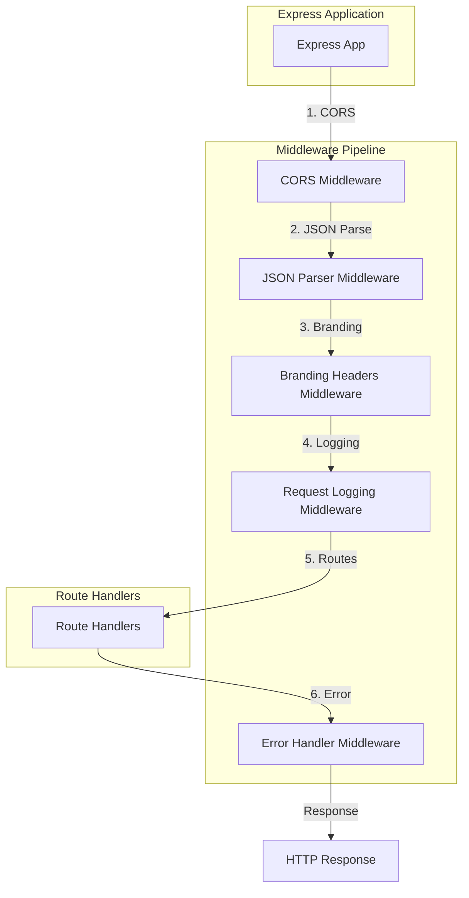
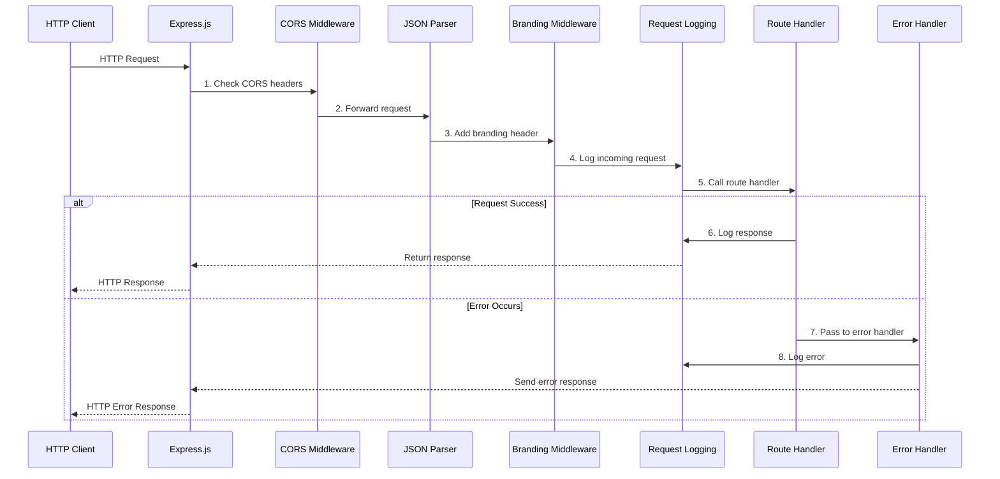
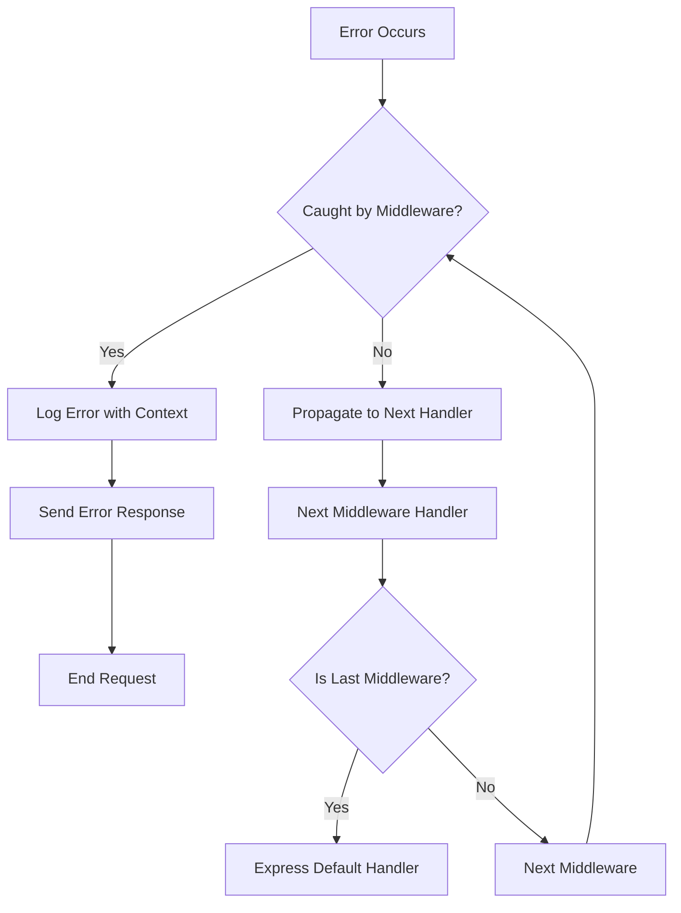
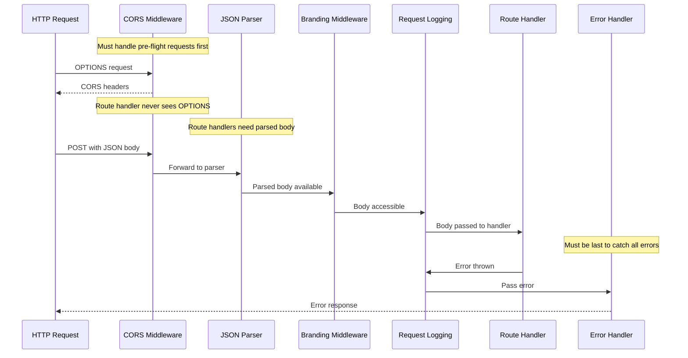

# Middleware Layer

This document describes the middleware architecture in Schemock, including all middleware components, their order, and responsibilities.

## Table of Contents

- [Overview](#overview)
- [Middleware Pipeline](#middleware-pipeline)
- [Individual Middleware](#individual-middleware)
- [Middleware Order](#middleware-order)
- [Custom Middleware](#custom-middleware)
- [Performance Considerations](#performance-considerations)

## Overview

Schemock uses Express.js middleware to handle cross-cutting concerns in the request-response cycle. Middleware provides:

- **CORS handling**: Cross-origin request support
- **Request parsing**: JSON body parsing
- **Request logging**: Incoming request tracking
- **Response branding**: Adding metadata to responses
- **Error handling**: Centralized error processing

### Middleware Architecture Diagram



## Middleware Pipeline

### Request Flow Through Middleware



### Middleware Execution Order

| Order | Middleware | Type | Direction | Purpose |
|--------|-----------|------|-----------|---------|
| 1 | CORS | Request/Response | Handle cross-origin requests |
| 2 | JSON Parser | Request | Parse request body |
| 3 | Branding Headers | Response | Add X-Powered-By header |
| 4 | Request Logging | Request/Response | Log request and response |
| 5 | Error Handler | Response | Catch and handle errors |

**ADR-022: Fixed Middleware Order**
**Decision**: Middleware is applied in a specific, fixed order.

**Rationale**:

- CORS must come first for pre-flight OPTIONS requests
- JSON parser needed before route handlers access body
- Branding headers added early in response pipeline
- Request logging captures all requests before processing
- Error handler must be last to catch all errors

## Individual Middleware

### 1. CORS Middleware

**Location**: [`src/generators/middleware.ts`](../src/generators/middleware.ts:15)

**Purpose**: Enables Cross-Origin Resource Sharing (CORS) for API endpoints.

**Implementation**:

```typescript
import cors from 'cors';

export function setupCors(app: Application, enabled: boolean): void {
  if (enabled) {
    app.use(cors());
    log.debug('CORS enabled', { module: 'server' });
  }
}
```

**Configuration**:

| Option | Type | Default | Description |
|---------|------|---------|-------------|
| `enabled` | boolean | `false` | Whether to enable CORS |

**Headers Added** (when enabled):

```http
Access-Control-Allow-Origin: *
Access-Control-Allow-Methods: GET, POST, PUT, DELETE, PATCH, OPTIONS
Access-Control-Allow-Headers: Content-Type, Authorization
```

**Use Cases**:

- Frontend applications on different domains
- Development with multiple origins
- Testing with cross-origin requests

**ADR-023: CORS Disabled by Default**
**Decision**: CORS is opt-in via configuration.

**Rationale**:

- Security: CORS should be explicitly enabled
- Flexibility: Different environments have different needs
- Developer control: Explicit decision required

### 2. JSON Parser Middleware

**Location**: [`src/generators/middleware.ts`](../src/generators/middleware.ts:25)

**Purpose**: Parses incoming request bodies as JSON.

**Implementation**:

```typescript
export function setupJsonParser(app: Application): void {
  app.use(express.json({ limit: '10mb' }));
}
```

**Configuration**:

| Option | Value | Description |
|---------|------|-------------|
| `limit` | `'10mb'` | Maximum request body size |

**Features**:

- Automatic JSON parsing
- Body size limit (10MB)
- Error handling for invalid JSON
- UTF-8 encoding support

**Error Handling**:

- Invalid JSON: Returns 400 Bad Request
- Body too large: Returns 413 Payload Too Large

**ADR-024: 10MB Body Limit**
**Decision**: Set 10MB limit on request body size.

**Rationale**:

- Prevents DoS attacks with large payloads
- Sufficient for most use cases
- Memory protection for server
- Configurable for special cases

### 3. Branding Headers Middleware

**Location**: [`src/generators/middleware.ts`](../src/generators/middleware.ts:32)

**Purpose**: Adds Schemock branding to responses.

**Implementation**:

```typescript
export function setupBrandingHeaders(app: Application, options: MiddlewareOptions): void {
  if (!options.hideBranding) {
    app.use((req: Request, res: Response, next: NextFunction) => {
      res.setHeader('X-Powered-By', `Schemock v${options.version}`);
      next();
    });
    log.debug('Branding enabled', { module: 'server' });
  }
}
```

**Configuration**:

| Option | Type | Default | Description |
|---------|------|---------|-------------|
| `hideBranding` | boolean | `false` | Whether to disable branding |
| `version` | string | From package.json | Schemock version |

**Headers Added** (when branding enabled):

```http
X-Powered-By: Schemock v1.0.0
```

**Response Metadata** (added in response body):

```typescript
{
  _meta: {
    generated_by: 'Schemock',
    version: '1.0.0',
    url: 'https://github.com/toxzak-svg/schemock-app'
  }
}
```

**Use Cases**:

- Attribution for Schemock
- Version tracking
- Paid users can disable branding

**ADR-025: Opt-Out Branding**
**Decision**: Branding is opt-out via configuration.

**Rationale**:

- Marketing: Branding promotes Schemock
- Revenue: Paid users can disable branding
- Developer control: Explicit decision required
- Default behavior: Show branding

### 4. Request Logging Middleware

**Location**: [`src/generators/middleware.ts`](../src/generators/middleware.ts:45)

**Purpose**: Logs incoming HTTP requests and responses.

**Implementation**:

```typescript
export function setupRequestLogging(app: Application): void {
  app.use((req: Request, res: Response, next: NextFunction) => {
    const startTime = Date.now();

    // Log request
    log.debug(`Incoming request`, {
      module: 'server',
      method: req.method,
      path: req.path,
      query: req.query,
      ip: req.ip
    });

    // Override res.json to capture status code and timing
    const originalJson = res.json.bind(res);
    res.json = function (body: unknown) {
      const duration = Date.now() - startTime;
      log.request(req.method, req.path, res.statusCode, duration);
      return originalJson(body);
    };

    next();
  });
}
```

**Logged Information**:

| Field | Description | Example |
|--------|-------------|---------|
| `timestamp` | ISO 8601 timestamp | `2026-01-09T05:00:00.000Z` |
| `level` | Log level | `INFO` |
| `message` | Log message | `GET /api/users` |
| `module` | Module name | `server` |
| `method` | HTTP method | `GET` |
| `path` | Request path | `/api/users` |
| `query` | Query parameters | `{ page: 1, limit: 10 }` |
| `ip` | Client IP address | `127.0.0.1` |
| `statusCode` | Response status code | `200` |
| `duration` | Request duration (ms) | `15` |

**Log Levels**:

| Level | When Logged |
|-------|-------------|
| `error` | All errors |
| `warn` | Errors and warnings, 4xx responses |
| `info` | Errors, warnings, and info (default) |
| `debug` | All requests and debug information |

**ADR-026: Non-Intrusive Logging**
**Decision**: Logging middleware doesn't modify request/response.

**Rationale**:

- Minimal performance impact
- No side effects on request processing
- Pure observation of request/response
- Easy to enable/disable

### 5. Error Handler Middleware

**Location**: [`src/generators/middleware.ts`](../src/generators/middleware.ts:73)

**Purpose**: Centralized error handling for all requests.

**Implementation**:

```typescript
export function setupErrorHandler(app: Application, logLevel?: string): void {
  app.use((err: Error, req: Request, res: Response, next: NextFunction) => {
    log.error('Request error', {
      module: 'server',
      error: err,
      method: req.method,
      path: req.path
    });

    res.status(500).json({
      error: 'Internal Server Error',
      message: logLevel === 'debug' ? err.message : 'An error occurred'
    });
  });
}
```

**Error Response Format**:

```json
{
  "error": "Internal Server Error",
  "message": "Detailed error message (debug mode only)"
}
```

**Error Handling Flow**:



**Error Context Logged**:

| Field | Description |
|--------|-------------|
| `module` | Module where error occurred |
| `error` | Error object with stack trace |
| `method` | HTTP method of request |
| `path` | Request path |

**ADR-027: Centralized Error Handling**
**Decision**: Single error handler middleware for all errors.

**Rationale**:

- Consistent error responses
- Centralized logging
- No error leakage to client
- Easy to add error monitoring

## Middleware Order

### Why Order Matters



### Middleware Order Rules

| Rule | Description |
|-------|-------------|
| **CORS First** | Must handle pre-flight OPTIONS requests |
| **JSON Parser Early** | Route handlers need parsed body |
| **Branding Before Logging** | Headers added before response sent |
| **Logging Before Routes** | Captures all requests |
| **Error Handler Last** | Catches all errors from middleware and routes |

**ADR-028: Middleware Order as Contract**
**Decision**: Middleware order is a fixed contract, not configurable.

**Rationale**:

- Predictable behavior
- No hidden dependencies on order
- Easier to debug
- Clear separation of concerns

## Custom Middleware

### Adding Custom Middleware

Developers can add custom middleware to Schemock servers:

```typescript
import { createMockServer } from 'schemock';

const server = createMockServer(schema, options);

// Get Express app
const app = server.getApp();

// Add custom middleware
app.use((req, res, next) => {
  // Custom logic
  console.log('Custom middleware:', req.path);
  next();
});

// Add custom middleware before routes
app.use((req, res, next) => {
  // Another custom middleware
  req.customData = 'added by custom middleware';
  next();
});

// Start server
server.start();
```

### Custom Middleware Use Cases

| Use Case | Example |
|-----------|---------|
| **Authentication** | Add JWT verification middleware |
| **Rate Limiting** | Add rate limiting middleware |
| **Request Validation** | Add request schema validation |
| **Compression** | Add gzip compression |
| **Metrics** | Add request metrics collection |

### Middleware Positioning

```mermaid
graph TB
    subgraph "Schemock Middleware"
        SchemockMW[Schemock Built-in Middleware]
    end

    subgraph "Custom Middleware"
        Custom1[Custom Middleware 1]
        Custom2[Custom Middleware 2]
        Custom3[Custom Middleware 3]
    end

    subgraph "Routes"
        Routes[Route Handlers]
    end

    Request[HTTP Request] --> SchemockMW
    SchemockMW --> Custom1
    Custom1 --> Custom2
    Custom2 --> Custom3
    Custom3 --> Routes

    style SchemockMW fill:#e1f5fe
    style Custom1 fill:#c5e1a5
    style Custom2 fill:#c5e1a5
    style Custom3 fill:#c5e1a5
    style Routes fill:#4caf50
```

**Placement Options**:

| Placement | Description | Use Case |
|----------|-------------|----------|
| **Before Schemock** | Add to app before `createMockServer` | Pre-processing |
| **After Schemock** | Add to app after `createMockServer` | Post-processing |
| **Before Routes** | Add via `app.use()` before routes | Request modification |
| **After Routes** | Add via `app.use()` after routes | Response modification |

## Performance Considerations

### Middleware Overhead

| Middleware | Overhead | Mitigation |
|-----------|----------|------------|
| **CORS** | Minimal | Only header checks |
| **JSON Parser** | Low | Streaming parsing, size limit |
| **Branding** | Minimal | Single header set |
| **Logging** | Low | Async logging, conditional |
| **Error Handler** | Minimal | Only on errors |

### Optimization Strategies

1. **Conditional Middleware**: Only apply when needed (e.g., CORS when enabled)
2. **Early Returns**: Skip unnecessary processing
3. **Async Logging**: Don't block on logging
4. **Minimal State**: Avoid storing request data in middleware
5. **Error Bubbling**: Only handle errors once

### Memory Usage

| Component | Memory Impact | Notes |
|-----------|---------------|-------|
| **CORS** | Negligible | Only configuration |
| **JSON Parser** | O(body size) | Streaming parser |
| **Branding** | Negligible | Single string |
| **Logging** | Low | Conditional based on log level |
| **Error Handler** | Negligible | Only on errors |

---

**Related Documents**:

- [System Overview](./01-system-overview.md) - High-level architecture
- [Component Architecture](./02-component-architecture.md) - Component details
- [Design Patterns](./04-design-patterns.md) - Patterns used
- [Data Flow](./03-data-flow.md) - Request lifecycle

**Last Updated**: 2026-01-09
