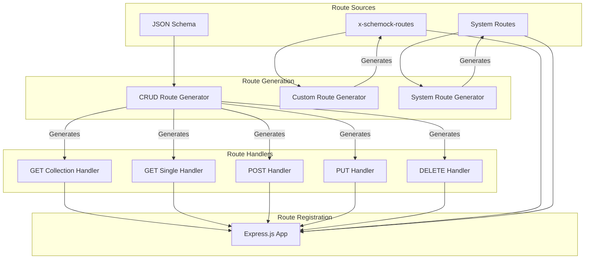
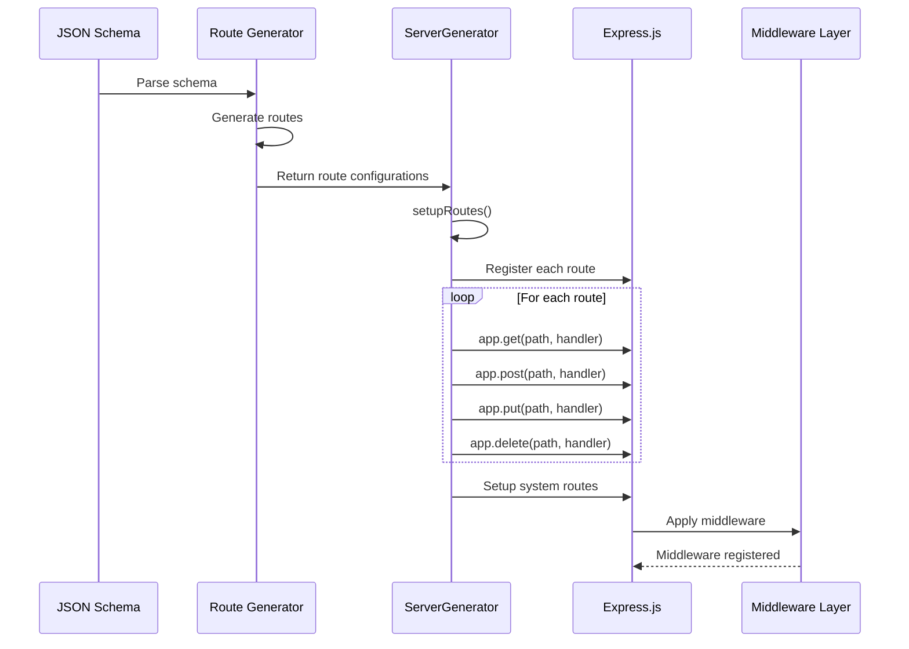

# Route Management

This document describes how routes are generated, registered, and handled in Schemock.

## Table of Contents

- [Overview](#overview)
- [Route Generation](#route-generation)
- [Route Registration](#route-registration)
- [Route Handlers](#route-handlers)
- [System Routes](#system-routes)
- [Route Configuration](#route-configuration)

## Overview

Schemock provides two primary ways to define routes:

1. **Automatic CRUD Routes**: Generated from JSON Schema
2. **Custom Routes**: Defined via `x-schemock-routes` extension
3. **System Routes**: Built-in endpoints (playground, health, share, gallery)

### Route Architecture Diagram



## Route Generation

### CRUD Route Generation

**Location**: [`src/generators/schema-routes.ts`](../src/generators/schema-routes.ts:373)

**Purpose**: Automatically generate RESTful CRUD routes from JSON Schema.

**Generated Routes**:

| Method | Path | Purpose | Status Code |
|--------|------|---------|-------------|
| GET | `/api/{resource}` | Get collection of items | 200 |
| GET | `/api/{resource}/:id` | Get single item by ID | 200 |
| POST | `/api/{resource}` | Create new item | 201 |
| PUT | `/api/{resource}/:id` | Update item by ID | 200 |
| DELETE | `/api/{resource}/:id` | Delete item by ID | 204 |

**Implementation**:

```typescript
export function generateCrudRoutes(
  basePath: string,
  schema: Schema,
  createHandler: (method: string, path: string, routeDef: object) => (req: RouteRequest, state: ServerState) => JSONValue
): Record<string, RouteConfig> {
  const routes: Record<string, RouteConfig> = {};

  const crudPaths = [
    { method: 'get', path: basePath },
    { method: 'get', path: `${basePath}/:id` },
    { method: 'post', path: basePath },
    { method: 'put', path: `${basePath}/:id` },
    { method: 'delete', path: `${basePath}/:id` }
  ];

  crudPaths.forEach(({ method, path }) => {
    const key = `${method}:${path}`;
    routes[key] = {
      path,
      method: method as 'get' | 'post' | 'put' | 'delete' | 'patch',
      statusCode: method === 'post' ? 201 : (method === 'delete' ? 204 : 200),
      response: createHandler(method, path, { response: schema }),
      schema: schema
    };
  });

  return routes;
}
```

**Resource Name Determination**:

```typescript
export function determineResourceName(schema: Schema, options: { resourceName?: string }): string {
  if (options.resourceName) {
    return options.resourceName;
  }
  if (schema.title) {
    const title = schema.title.toLowerCase();
    return title.endsWith('s') ? title : title + 's';
  }
  return 'data';
}
```

**Base Path Determination**:

```typescript
export function determineBasePath(resourceName: string, options: { basePath?: string }): string {
  return options.basePath || `/api/${resourceName}`;
}
```

**ADR-029: Automatic CRUD Generation**
**Decision**: Automatically generate CRUD routes from schema.

**Rationale**:

- Convention over configuration
- Quick start for common use cases
- Consistent API structure
- Reduces boilerplate

### Custom Route Generation

**Location**: [`src/generators/schema-routes.ts`](../src/generators/schema-routes.ts:324)

**Purpose**: Generate routes from `x-schemock-routes` schema extension.

**Schema Extension**:

```json
{
  "type": "object",
  "title": "User",
  "properties": {
    "id": { "type": "string", "format": "uuid" },
    "name": { "type": "string" },
    "email": { "type": "string", "format": "email" }
  },
  "x-schemock-routes": [
    {
      "path": "/api/users",
      "method": "get",
      "response": { "type": "array", "items": { "$ref": "#/definitions/User" } }
    },
    {
      "path": "/api/users/:id",
      "method": "get",
      "response": { "$ref": "#/definitions/User" }
    },
    {
      "path": "/api/search",
      "method": "post",
      "response": {
        "type": "object",
        "properties": {
          "results": { "type": "array", "items": { "$ref": "#/definitions/User" } },
          "total": { "type": "integer" }
        }
      }
    }
  ],
  "definitions": {
    "User": {
      "type": "object",
      "properties": {
        "id": { "type": "string", "format": "uuid" },
        "name": { "type": "string" },
        "email": { "type": "string", "format": "email" }
      }
    }
  }
}
```

**Implementation**:

```typescript
export function generateCustomRoutes(
  schema: Schema,
  createHandler: (method: string, path: string, routeDef: object) => (req: RouteRequest, state: ServerState) => JSONValue
): Record<string, RouteConfig> {
  const routes: Record<string, RouteConfig> = {};

  if (!schema['x-schemock-routes'] || !Array.isArray(schema['x-schemock-routes'])) {
    return routes;
  }

  schema['x-schemock-routes'].forEach((routeDef: {
    path: string;
    method: string;
    response?: JSONValue | Schema;
    statusCode?: number;
    delay?: number;
    headers?: Record<string, string>
  }) => {
    const method = routeDef.method.toLowerCase();
    const path = routeDef.path;
    const key = `${method}:${path}`;

    routes[key] = {
      path,
      method: method as 'get' | 'post' | 'put' | 'delete' | 'patch',
      statusCode: routeDef.statusCode || (method === 'post' ? 201 : 200),
      delay: routeDef.delay || 0,
      headers: routeDef.headers || {},
      response: createHandler(method, path, routeDef),
      schema: routeDef.response && typeof routeDef.response === 'object' && 'type' in routeDef.response
        ? routeDef.response as Schema
        : undefined
    };
  });

  return routes;
}
```

**ADR-030: Custom Routes via Schema Extension**
**Decision**: Use `x-schemock-routes` schema extension for custom routes.

**Rationale**:

- Schema-driven approach
- All route definitions in one place
- No separate route configuration file
- Leverages JSON Schema ecosystem
- Easy to validate and document

## Route Registration

### Route Registration Flow



### Route Registration Implementation

**Location**: [`src/generators/server.ts`](../src/generators/server.ts:87)

```typescript
export class ServerGenerator {
  private setupRoutes(): void {
    // Setup each route from the config
    Object.entries(this.config.routes).forEach(([_, routeConfig]) => {
      this.setupRoute(routeConfig);
    });

    // Setup system routes (playground, health, share, gallery)
    setupSystemRoutes(this.app, this.config, this.version);
  }

  private setupRoute(routeConfig: RouteConfig): void {
    const { path, method, response, statusCode = 200, delay = 0, headers = {}, schema } = routeConfig;

    const routeHandler = async (req: Request, res: Response, next: NextFunction) => {
      // Handler implementation
      // ... delay, scenario, validation, response handling
    };

    // Register the route with the specified HTTP method
    switch (method.toLowerCase()) {
      case 'get':
        this.app.get(path, routeHandler);
        break;
      case 'post':
        this.app.post(path, routeHandler);
        break;
      case 'put':
        this.app.put(path, routeHandler);
        break;
      case 'delete':
        this.app.delete(path, routeHandler);
        break;
      case 'patch':
        this.app.patch(path, routeHandler);
        break;
      default:
        throw new ServerError(`Unsupported HTTP method: ${method}`, { method });
    }
  }
}
```

## Route Handlers

### GET Collection Handler

**Location**: [`src/generators/schema-routes.ts`](../src/generators/schema-routes.ts:126)

**Purpose**: Handle requests for a collection of items.

**Implementation**:

```typescript
function handleGetCollection(
  state: ServerState,
  resource: string,
  responseSchema: Schema,
  mainSchema: Schema,
  options: { strict?: boolean },
  wrap: boolean
): JSONValue {
  // Return list from state
  if (state[resource].length === 0) {
    // Populate with some initial data
    const generated = SchemaParser.parse(responseSchema, mainSchema, new Set(), options.strict, resource);
    if (Array.isArray(generated)) {
      state[resource] = generated;
    } else {
      // Generate 3 items if not array
      for (let i = 0; i < 3; i++) {
        const item = SchemaParser.parse(responseSchema, mainSchema, new Set(), options.strict, resource);
        if (item && typeof item === 'object' && !Array.isArray(item)) {
          const itemObj = item as Record<string, JSONValue>;
          if (!itemObj.id) {
            itemObj.id = uuidv4();
          }
        }
        state[resource].push(item);
      }
    }
  }

  return wrap ? {
    success: true,
    message: 'Mock data retrieved',
    timestamp: new Date().toISOString(),
    data: state[resource],
    meta: { total: state[resource].length }
  } : state[resource];
}
```

**Behavior**:

- Returns empty array if no items in state
- Generates 3 initial items on first request
- Wraps response in success envelope if `wrap=true`
- Includes metadata with total count

### GET Single Handler

**Location**: [`src/generators/schema-routes.ts`](../src/generators/schema-routes.ts:76)

**Purpose**: Handle requests for a single item by ID.

**Implementation**:

```typescript
function handleGetById(
  state: ServerState,
  resource: string,
  req: RouteRequest,
  responseSchema: Schema,
  mainSchema: Schema,
  options: { strict?: boolean },
  wrap: boolean
): JSONValue {
  const item = state[resource].find((i: JSONValue) =>
    typeof i === 'object' && i !== null && 'id' in i && i.id === req.params?.id
  );

  if (item) {
    return wrap ? {
      success: true,
      message: 'Mock data retrieved',
      timestamp: new Date().toISOString(),
      data: item
    } : item;
  }

  // Fallback: generate, tie to ID, and store in state for consistency
  let data = SchemaParser.parse(responseSchema, mainSchema, new Set(), options.strict, resource);
  if (data && typeof data === 'object' && !Array.isArray(data) && req.params?.id) {
    const dataObj = data as Record<string, JSONValue>;
    dataObj.id = req.params.id;
    state[resource].push(dataObj);
    data = dataObj;
  }

  return wrap ? {
    success: true,
    message: 'Mock data generated',
    timestamp: new Date().toISOString(),
    data
  } : data;
}
```

**Behavior**:

- Returns existing item if found in state
- Generates new item with requested ID if not found
- Stores generated item in state for consistency
- Wraps response in success envelope if `wrap=true`

### POST Handler

**Location**: [`src/generators/schema-routes.ts`](../src/generators/schema-routes.ts:172)

**Purpose**: Handle requests to create new items.

**Implementation**:

```typescript
function handlePost(
  state: ServerState,
  resource: string,
  req: RouteRequest,
  wrap: boolean
): JSONValue {
  const bodyObj = typeof req.body === 'object' && req.body !== null ? req.body as Record<string, unknown> : {};
  const newItem: Record<string, JSONValue> = {
    id: (bodyObj.id as string) || uuidv4(),
    ...bodyObj as Record<string, JSONValue>,
    createdAt: new Date().toISOString(),
    updatedAt: new Date().toISOString()
  };
  state[resource].push(newItem);

  return wrap ? { success: true, data: newItem, message: 'Created successfully' } : newItem;
}
```

**Behavior**:

- Generates UUID if not provided in body
- Merges request body with timestamps
- Adds item to state collection
- Returns 201 status code (set during registration)
- Wraps response in success envelope if `wrap=true`

### PUT Handler

**Location**: [`src/generators/schema-routes.ts`](../src/generators/schema-routes.ts:199)

**Purpose**: Handle requests to update existing items.

**Implementation**:

```typescript
function handlePut(
  state: ServerState,
  resource: string,
  req: RouteRequest,
  wrap: boolean
): JSONValue {
  const index = state[resource].findIndex((i: JSONValue) =>
    typeof i === 'object' && i !== null && 'id' in i && i.id === req.params?.id
  );

  const bodyObj = typeof req.body === 'object' && req.body !== null ? req.body as Record<string, unknown> : {};
  const existingItem = index >= 0 && typeof state[resource][index] === 'object' && state[resource][index] !== null
    ? state[resource][index] as Record<string, unknown>
    : {};

  const updatedItem: Record<string, JSONValue> = {
    ...(existingItem as Record<string, JSONValue>),
    ...bodyObj as Record<string, JSONValue>,
    id: req.params?.id || '',
    updatedAt: new Date().toISOString()
  };

  if (index >= 0) {
    state[resource][index] = updatedItem;
  } else {
    state[resource].push(updatedItem);
  }

  return wrap ? { success: true, data: updatedItem } : updatedItem;
}
```

**Behavior**:

- Updates existing item if found
- Creates new item if not found (upsert behavior)
- Preserves existing properties not in request body
- Prevents ID change
- Adds updatedAt timestamp
- Returns 200 status code

### DELETE Handler

**Location**: [`src/generators/schema-routes.ts`](../src/generators/schema-routes.ts:239)

**Purpose**: Handle requests to delete items.

**Implementation**:

```typescript
function handleDelete(
  state: ServerState,
  resource: string,
  req: RouteRequest,
  wrap: boolean
): JSONValue {
  state[resource] = state[resource].filter((i: JSONValue) =>
    typeof i === 'object' && i !== null && 'id' in i && i.id !== req.params?.id
  );

  return wrap ? { success: true, message: 'Deleted successfully' } : { message: 'Deleted successfully' };
}
```

**Behavior**:

- Filters out item with matching ID
- Returns 204 status code (set during registration)
- Wraps response in success envelope if `wrap=true`
- Does not return deleted item

## System Routes

### Playground Route

**Location**: [`src/generators/route-setup.ts`](../src/generators/route-setup.ts:15)

**Purpose**: Provides interactive HTML playground for API testing.

**Implementation**:

```typescript
export function setupPlaygroundRoute(app: Application, routes: Record<string, RouteConfig>): void {
  app.get('/', (req: Request, res: Response) => {
    const html = getPlaygroundHTML(routes);
    res.send(html);
  });
}
```

**Features**:

- List all available routes
- Try it out functionality for each route
- Schema view tab
- Example response tab
- Copy response to clipboard
- Share schema button
- Link to schema gallery

**ADR-031: Playground as HTML String**
**Decision**: Playground is generated as HTML string, not template file.

**Rationale**:

- No build step required
- Easy to customize
- No file I/O overhead
- Single-file deployment

### Health Check Route

**Location**: [`src/generators/route-setup.ts`](../src/generators/route-setup.ts:25)

**Purpose**: Provides server health status endpoint.

**Implementation**:

```typescript
export function setupHealthCheckRoute(app: Application): void {
  app.get('/health', (req: Request, res: Response) => {
    res.json({
      status: 'healthy',
      timestamp: new Date().toISOString(),
      uptime: process.uptime()
    });
  });
}
```

**Response Format**:

```json
{
  "status": "healthy",
  "timestamp": "2026-01-09T05:00:00.000Z",
  "uptime": 123.456
}
```

**Use Cases**:

- Health monitoring
- Load balancer checks
- Container orchestration probes

### Share Route

**Location**: [`src/generators/route-setup.ts`](../src/generators/route-setup.ts:38)

**Purpose**: Exports current server configuration for sharing.

**Implementation**:

```typescript
export function setupShareRoute(app: Application, config: MockServerConfig, version: string): void {
  app.get('/api/share', (req: Request, res: Response) => {
    const shareData = {
      routes: config.routes,
      server: {
        port: config.server.port,
        cors: config.server.cors
      },
      version: version,
      createdAt: new Date().toISOString()
    };
    res.json(shareData);
  });
}
```

**Response Format**:

```json
{
  "routes": {
    "get:/api/users": { ... },
    "post:/api/users": { ... }
  },
  "server": {
    "port": 3000,
    "cors": true
  },
  "version": "1.0.0",
  "createdAt": "2026-01-09T05:00:00.000Z"
}
```

### Gallery Route

**Location**: [`src/generators/route-setup.ts`](../src/generators/route-setup.ts:56)

**Purpose**: Provides example schemas for learning and quick starts.

**Implementation**:

```typescript
export function setupGalleryRoute(app: Application, version: string): void {
  app.get('/api/gallery', (req: Request, res: Response) => {
    const publicSchemas = [
      {
        id: 'ecommerce-product',
        title: 'E-commerce Product API',
        description: 'Complete product management API with categories, pricing, and inventory',
        url: 'https://github.com/toxzak-svg/schemock-app',
        schema: { /* schema object */ }
      },
      // ... more schemas
    ];

    res.json({
      schemas: publicSchemas,
      total: publicSchemas.length,
      message: 'Made with Schemock'
    });
  });
}
```

**Response Format**:

```json
{
  "schemas": [
    { "id": "ecommerce-product", "title": "...", "schema": {...} },
    { "id": "social-media-post", "title": "...", "schema": {...} }
  ],
  "total": 3,
  "message": "Made with Schemock"
}
```

## Route Configuration

### RouteConfig Interface

**Location**: [`src/types/index.ts`](../src/types/index.ts:87)

```typescript
interface RouteConfig {
  path: string;                    // Route path (e.g., '/api/users')
  method: 'get' | 'post' | 'put' | 'delete' | 'patch';
  response: RouteResponse;           // Response data, schema, or handler function
  statusCode?: number;            // HTTP status code (default: 200 for GET/PUT, 201 for POST, 204 for DELETE)
  delay?: number;                 // Response delay in milliseconds (default: 0)
  headers?: Record<string, string>; // Custom response headers
  schema?: Schema;                // Schema for response generation (if response is schema)
}
```

### Response Types

```typescript
// Static JSON value
type StaticResponse = {
  success: true,
  data: { id: '123', name: 'Test' }
};

// Schema to generate mock data
type SchemaResponse = {
  type: 'object',
  properties: {
    id: { type: 'string' },
    name: { type: 'string' }
  }
};

// Dynamic handler function
type HandlerResponse = (req: RouteRequest, state: ServerState) => JSONValue;

// Union of all types
type RouteResponse = JSONValue | Schema | ResponseHandler;
```

### Route Key Format

Routes are keyed by `method:path` for unique identification:

```typescript
const routes: Record<string, RouteConfig> = {
  'get:/api/users': { path: '/api/users', method: 'get', response: {...} },
  'post:/api/users': { path: '/api/users', method: 'post', response: {...} },
  'get:/api/users/:id': { path: '/api/users/:id', method: 'get', response: {...} },
  'put:/api/users/:id': { path: '/api/users/:id', method: 'put', response: {...} },
  'delete:/api/users/:id': { path: '/api/users/:id', method: 'delete', response: {...} }
};
```

### Route Matching

Express.js matches routes in the order they are registered:

```mermaid
graph LR
    Request[Incoming Request] --> R1[/api/users]
    Request --> R2[/api/users/:id]
    Request --> R3[/api/search]

    R1 -->|First Match| Handler1[Collection Handler]
    R2 -->|Second Match| Handler2[Single Handler]
    R3 -->|Third Match| Handler3[Search Handler]
```

**Matching Rules**:

- Exact path match for `/api/users`
- Parameter match for `/api/users/:id`
- First match wins (register order matters)
- Routes with `:id` will match `/api/users/123`

---

**Related Documents**:

- [System Overview](./01-system-overview.md) - High-level architecture
- [Component Architecture](./02-component-architecture.md) - Component details
- [Design Patterns](./04-design-patterns.md) - Patterns used
- [Middleware Layer](./05-middleware-layer.md) - Middleware details

**Last Updated**: 2026-01-09
