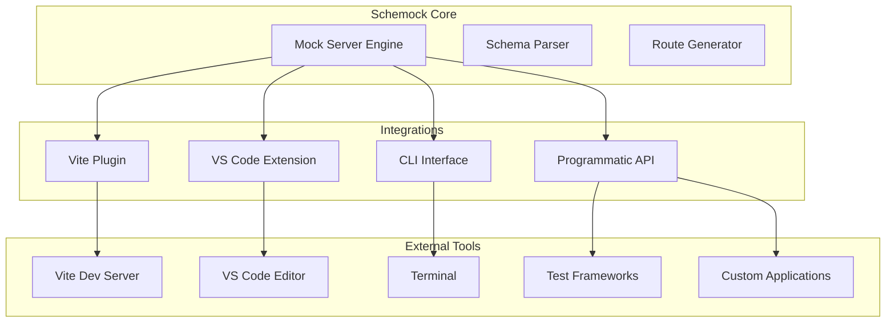
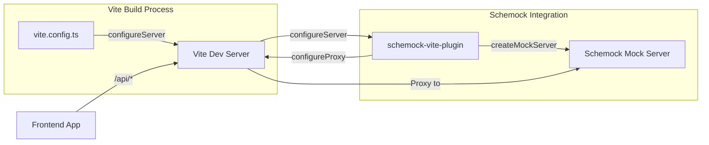
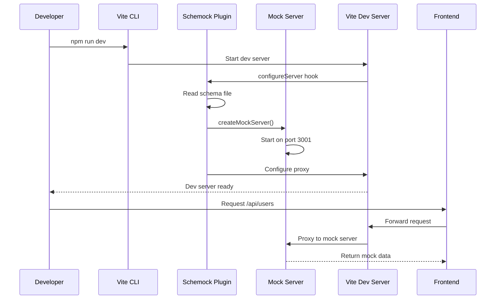
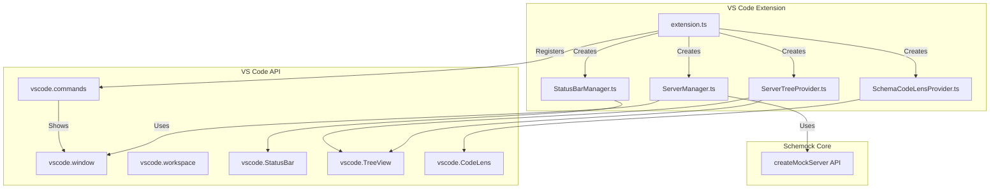
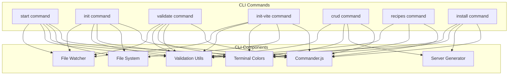
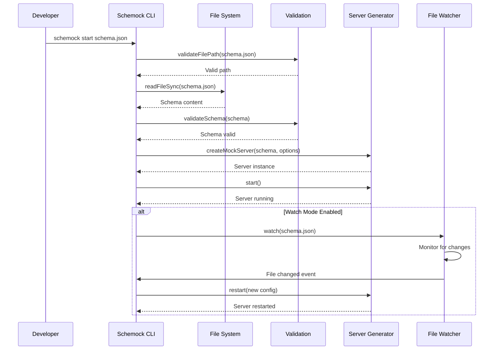
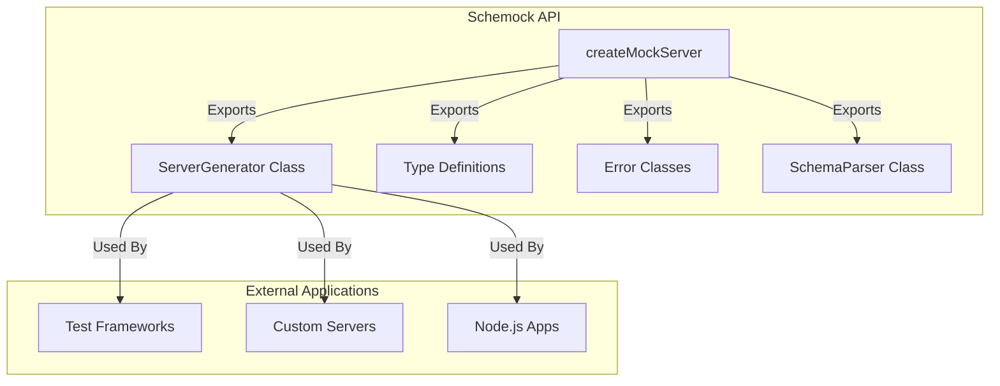

# Integrations

This document describes the various integrations Schemock provides with external tools and platforms.

## Table of Contents

- [Overview](#overview)
- [Vite Integration](#vite-integration)
- [VS Code Extension](#vs-code-extension)
- [CLI Integration](#cli-integration)
- [Programmatic API](#programmatic-api)

## Overview

Schemock provides multiple integration points to work seamlessly with different development environments:



## Vite Integration

### Plugin Overview

**Location**: [`src/integrations/vite.ts`](../src/integrations/vite.ts:1)

**Purpose**: Automatically start a Schemock mock server alongside Vite dev server and proxy API requests.

### Vite Plugin Architecture



### Plugin Implementation

```typescript
import { createMockServer } from '../index';
import { resolve } from 'path';
import { readFileSync, existsSync } from 'fs';
import { log } from '../utils/logger';

export interface SchemockViteOptions {
  schemaPath?: string;      // Path to schema file (default: 'mocks/api.json')
  prefix?: string;          // API prefix to proxy (default: '/api')
  port?: number;            // Mock server port (default: 3001)
  watch?: boolean;           // Enable file watching (default: true)
}

export function schemockVitePlugin(options: SchemockViteOptions = {}) {
  const {
    schemaPath = 'mocks/api.json',
    prefix = '/api',
    port = 3001,
    watch = true
  } = options;

  return {
    name: 'vite-plugin-schemock',

    // Vite lifecycle hook
    configureServer(server: any) {
      const absolutePath = resolve(server.config.root, schemaPath);

      // Check if schema exists
      if (!existsSync(absolutePath)) {
        log.warn(`[Schemock] Schema not found at ${absolutePath}. Skipping mock server setup.`, {
          module: 'vite-plugin'
        });
        log.info('💡 Hint: Run `schemock init-vite` to set up necessary files.');
        return;
      }

      try {
        log.info(`[Schemock] Starting mock server from ${schemaPath}...`, {
          module: 'vite-plugin'
        });

        // Read and parse schema
        const fileContent = readFileSync(absolutePath, 'utf-8');
        const schema = JSON.parse(fileContent);

        // Create mock server
        const mockServer = createMockServer(schema, {
          port,
          cors: true,
          logLevel: 'info',
          watch
        });

        // Start mock server
        mockServer.start().catch((err: any) => {
          if (err.code === 'EADDRINUSE') {
            log.error(`[Schemock] Port ${port} is already in use. Try a different port in your vite.config.ts`, {
              module: 'vite-plugin'
            });
          } else {
            log.error(`[Schemock] Failed to start: ${err.message}`, {
              module: 'vite-plugin'
            });
          }
        });

        // Configure Vite proxy
        if (!server.config.server.proxy) {
          server.config.server.proxy = {};
        }

        server.config.server.proxy[prefix] = {
          target: `http://localhost:${port}`,
          changeOrigin: true,
          secure: false
        };

        log.info(`[Schemock] Proxy configured: ${prefix} -> http://localhost:${port}`, {
          module: 'vite-plugin'
        });
        log.info(`[Schemock] Interactive playground: http://localhost:${port}/`, {
          module: 'vite-plugin'
        });
      } catch (error: any) {
        log.error(`[Schemock] Error in Vite plugin: ${error.message}`, {
          module: 'vite-plugin'
        });
      }
    }
  };
}
```

### Vite Integration Flow



### Vite Configuration

**vite.config.ts**:

```typescript
import { defineConfig } from 'vite';
import { schemockVitePlugin } from 'schemock';

export default defineConfig({
  plugins: [
    schemockVitePlugin({
      schemaPath: 'mocks/api.json',
      prefix: '/api',
      port: 3001,
      watch: true
    })
  ]
});
```

### CLI Integration

**Location**: [`src/cli/index.ts`](../src/cli/index.ts:420)

**Purpose**: Provides `schemock init-vite` command to set up Vite integration.

**Implementation**:

```typescript
program
  .command('init-vite')
  .description('Integrate Schemock into an existing Vite project')
  .option('--prefix <prefix>', 'API prefix to proxy', '/api')
  .option('--port <port>', 'Mock server port', '3001')
  .action((options) => {
    try {
      const projectDir = process.cwd();
      const prefix = options.prefix || '/api';
      const port = validatePort(options.port || '3001');

      // Check if it's a Vite project
      const hasVite = existsSync(join(projectDir, 'vite.config.ts')) ||
                      existsSync(join(projectDir, 'vite.config.js'));

      if (!hasVite) {
        console.warn(chalk.yellow('⚠️ No vite.config.ts or vite.config.js found in the current directory.'));
        console.warn(chalk.yellow('Continuing anyway, but you might need to configure Vite manually.'));
      }

      // Create mocks directory
      const mocksDir = join(projectDir, 'mocks');
      if (!existsSync(mocksDir)) {
        mkdirSync(mocksDir);
      }

      // Create sample schema
      const sampleSchema = {
        $schema: 'http://json-schema.org/draft-07/schema#',
        title: 'Mock API',
        type: 'object',
        properties: {
          users: {
            type: 'array',
            items: {
              type: 'object',
              properties: {
                id: { type: 'string', format: 'uuid' },
                name: { type: 'string' },
                email: { type: 'string', format: 'email' }
              },
              required: ['id', 'name']
            }
          }
        }
      };

      writeFileSync(join(mocksDir, 'api.json'), JSON.stringify(sampleSchema, null, 2));

      // Add mock script to package.json
      const packageJsonPath = join(projectDir, 'package.json');
      if (existsSync(packageJsonPath)) {
        const packageJson = JSON.parse(readFileSync(packageJsonPath, 'utf-8'));
        packageJson.scripts = packageJson.scripts || {};
        packageJson.scripts['mock'] = 'schemock start mocks/api.json --watch';
        writeFileSync(packageJsonPath, JSON.stringify(packageJson, null, 2));
      }

      console.log(chalk.green('\n✅ Schemock Vite integration initialized!'));
      console.log(chalk.blue('\n👉 Next steps:'));
      console.log(chalk.blue('1. Install Schemock:'));
      console.log(chalk.cyan('   npm install --save-dev schemock'));
      console.log(chalk.blue('2. Add the plugin to your vite.config.ts:'));
      console.log(chalk.gray(`
import { defineConfig } from 'vite';
import { schemockVitePlugin } from 'schemock';

export default defineConfig({
  plugins: [
    schemockVitePlugin({
      schemaPath: 'mocks/api.json',
      prefix: '${prefix}',
      port: ${port}
    })
  ]
});
      `));
      console.log(chalk.blue('3. Start your dev server:'));
      console.log(chalk.cyan('   npm run dev'));
    } catch (error: unknown) {
      const message = error instanceof Error ? formatError(error) : 'Unknown error occurred';
      console.error(chalk.red('❌ Error initializing Vite integration:'));
      console.error(chalk.red(message));
      process.exit(1);
    }
  });
```

**ADR-032: Vite Plugin as Separate Package**
**Decision**: Vite plugin is a separate package from core schemock.

**Rationale**:

- Optional dependency for Vite users
- Reduces bundle size for non-Vite users
- Clear separation of concerns
- Easy to version independently

## VS Code Extension

### Extension Overview

**Location**: [`vscode-extension/`](../vscode-extension/)

**Purpose**: Provides VS Code integration for managing Schemock mock servers.

### VS Code Extension Architecture



### Extension Implementation

**Main Extension File**: [`vscode-extension/src/extension.ts`](../vscode-extension/src/extension.ts)

```typescript
import * as vscode from 'vscode';
import { ServerManager } from './server/ServerManager';
import { StatusBarManager } from './statusbar/StatusBarManager';
import { ServerTreeProvider } from './tree/ServerTreeProvider';
import { SchemaCodeLensProvider } from './codelens/SchemaCodeLensProvider';

export function activate(context: vscode.ExtensionContext) {
  // Create managers
  const serverManager = new ServerManager(context);
  const statusBarManager = new StatusBarManager(context);
  const treeProvider = new ServerTreeProvider(context);
  const codeLensProvider = new SchemaCodeLensProvider(context);

  // Register commands
  const startCommand = vscode.commands.registerCommand('schemock.start', async () => {
    await serverManager.start();
  });

  const stopCommand = vscode.commands.registerCommand('schemock.stop', async () => {
    await serverManager.stop();
  });

  const restartCommand = vscode.commands.registerCommand('schemock.restart', async () => {
    await serverManager.restart();
  });

  // Register tree view
  vscode.window.registerTreeDataProvider('schemockRoutes', treeProvider);

  // Register code lens
  vscode.languages.registerCodeLensProvider(
    ['json', 'jsonc'],
    codeLensProvider
  );

  // Show status bar
  statusBarManager.show();

  context.subscriptions.push(
    startCommand,
    stopCommand,
    restartCommand
  );
}

export function deactivate() {
  // Cleanup
}
```

### Server Manager

**Location**: [`vscode-extension/src/server/ServerManager.ts`](../vscode-extension/src/server/ServerManager.ts)

**Purpose**: Manages Schemock server lifecycle from VS Code.

```typescript
import { createMockServer } from 'schemock';

export class ServerManager {
  private server: any = null;
  private context: vscode.ExtensionContext;

  constructor(context: vscode.ExtensionContext) {
    this.context = context;
  }

  async start(): Promise<void> {
    const schema = await this.loadSchema();
    this.server = createMockServer(schema, {
      port: 3000,
      cors: true,
      logLevel: 'info'
    });
    await this.server.start();
    vscode.window.showInformationMessage('Schemock server started on port 3000');
  }

  async stop(): Promise<void> {
    if (this.server) {
      await this.server.stop();
      this.server = null;
      vscode.window.showInformationMessage('Schemock server stopped');
    }
  }

  async restart(): Promise<void> {
    await this.stop();
    await this.start();
  }

  private async loadSchema(): Promise<any> {
    // Load schema from active JSON file
    const editor = vscode.window.activeTextEditor;
    if (editor) {
      const content = editor.document.getText();
      return JSON.parse(content);
    }
    return {};
  }
}
```

### Status Bar Manager

**Location**: [`vscode-extension/src/statusbar/StatusBarManager.ts`](../vscode-extension/src/statusbar/StatusBarManager.ts)

**Purpose**: Displays server status in VS Code status bar.

```typescript
import * as vscode from 'vscode';

export class StatusBarManager {
  private statusBarItem: vscode.StatusBarItem;

  constructor(context: vscode.ExtensionContext) {
    this.statusBarItem = vscode.window.createStatusBarItem(
      'schemock.status',
      vscode.StatusBarAlignment.Right
    );
    this.statusBarItem.command = 'schemock.toggle';
    context.subscriptions.push(this.statusBarItem);
  }

  show(): void {
    this.statusBarItem.text = '$(schemock) Stopped';
    this.statusBarItem.show();
  }

  update(status: 'running' | 'stopped'): void {
    if (status === 'running') {
      this.statusBarItem.text = '$(schemock) Running';
      this.statusBarItem.backgroundColor = new vscode.ThemeColor('statusBar.foreground');
    } else {
      this.statusBarItem.text = '$(schemock) Stopped';
      this.statusBarItem.backgroundColor = undefined;
    }
  }
}
```

### Tree View Provider

**Location**: [`vscode-extension/src/tree/ServerTreeProvider.ts`](../vscode-extension/src/tree/ServerTreeProvider.ts)

**Purpose**: Displays available routes in VS Code tree view.

```typescript
import * as vscode from 'vscode';
import { TreeItem, TreeDataProvider } from 'vscode';

export class ServerTreeProvider implements TreeDataProvider<any> {
  private routes: any[] = [];

  constructor(private context: vscode.ExtensionContext) {}

  refresh(routes: any[]): void {
    this.routes = routes;
    this._onDidChangeTreeData.fire();
  }

  getTreeItem(element: any): TreeItem {
    if (!element) {
      // Root item
      return new TreeItem('Routes', vscode.TreeItemCollapsibleState.Expanded);
    }

    // Route items
    return new TreeItem(
      `${element.method.toUpperCase()} ${element.path}`,
      vscode.TreeItemCollapsibleState.None
    );
  }

  private _onDidChangeTreeData = new vscode.EventEmitter<any>();
  readonly onDidChangeTreeData = this._onDidChangeTreeData.event;
}
```

### Code Lens Provider

**Location**: [`vscode-extension/src/codelens/SchemaCodeLensProvider.ts`](../vscode-extension/src/codelens/SchemaCodeLensProvider.ts)

**Purpose**: Provides code lens actions for JSON schemas.

```typescript
import * as vscode from 'vscode';
import { CodeLens, CodeLensProvider } from 'vscode';

export class SchemaCodeLensProvider implements CodeLensProvider {
  provideCodeLenses(
    document: vscode.TextDocument,
    token: vscode.CancellationToken
  ): CodeLens[] {
    const codeLenses: CodeLens[] = [];

    // Add code lens for "Start Server" button
    codeLenses.push(new vscode.CodeLens(
      new vscode.Range(0, 0, 0, 0),
      {
        title: 'Start Schemock Server',
        command: 'schemock.start',
        arguments: [document.uri]
      }
    ));

    return codeLenses;
  }

  resolveCodeLens(
    codeLens: CodeLens,
    token: vscode.CancellationToken
  ): vscode.CodeLens {
    return codeLens;
  }
}
```

**ADR-033: VS Code Extension as Separate Workspace**
**Decision**: VS Code extension is a separate workspace from core schemock.

**Rationale**:

- Optional dependency for VS Code users
- Independent versioning and release cycle
- Clear separation of concerns
- Different installation mechanism (VSIX)

## CLI Integration

### CLI Overview

**Location**: [`src/cli/index.ts`](../src/cli/index.ts:1)

**Purpose**: Provides command-line interface for Schemock.

### CLI Architecture



### CLI Commands

| Command | Description | Options |
|---------|-------------|---------|
| `start [schemaPath]` | Start mock server with schema | `--port`, `--no-cors`, `--log-level`, `--watch`, `--scenario`, `--strict`, `--resource` |
| `init [directory]` | Initialize new project | `--name`, `--port` |
| `validate <schemaPath>` | Validate JSON schema | `--strict` |
| `init-vite` | Integrate with Vite | `--prefix`, `--port` |
| `crud <resource>` | Generate CRUD schema | `--output` |
| `recipes` | Show integration guides | None |
| `install` | Launch installer UI | `--port` |

### CLI Flow



**ADR-034: CLI as Entry Point**
**Decision**: CLI is the primary entry point for most users.

**Rationale**:

- Familiar interface for developers
- Quick setup without code
- All features accessible from CLI
- Easy to script and automate

## Programmatic API

### API Overview

**Location**: [`src/index.ts`](../src/index.ts:1)

**Purpose**: Provides TypeScript/JavaScript API for programmatic usage.

### API Architecture



### API Usage

```typescript
import { createMockServer, ServerOptions, Schema } from 'schemock';

// Define schema
const userSchema: Schema = {
  type: 'object',
  properties: {
    id: { type: 'string', format: 'uuid' },
    name: { type: 'string', minLength: 1 },
    email: { type: 'string', format: 'email' }
  },
  required: ['id', 'name', 'email']
};

// Configure server options
const options: ServerOptions = {
  port: 3000,
  cors: true,
  logLevel: 'info',
  scenario: 'happy-path'
};

// Create and start server
const server = createMockServer(userSchema, options);

// Start server
await server.start();

// Get Express app for custom middleware
const app = server.getApp();

// Add custom middleware
app.use((req, res, next) => {
  console.log('Custom middleware:', req.path);
  next();
});

// Stop server
await server.stop();
```

### API with Testing

```typescript
import request from 'supertest';
import { createMockServer } from 'schemock';

describe('API Tests', () => {
  let server: any;

  beforeAll(async () => {
    server = createMockServer(userSchema, { port: 3001 });
    await server.start();
  });

  afterAll(async () => {
    await server.stop();
  });

  test('GET /api/users returns users', async () => {
    const response = await request(server.getApp())
      .get('/api/users')
      .expect(200);

    expect(response.body).toHaveProperty('success');
    expect(response.body.data).toBeInstanceOf(Array);
  });

  test('POST /api/users creates user', async () => {
    const response = await request(server.getApp())
      .post('/api/users')
      .send({ name: 'Test User' })
      .expect(201);

    expect(response.body.success).toBe(true);
    expect(response.body.data).toHaveProperty('id');
  });
});
```

**ADR-035: Programmatic API as Core**
**Decision**: Programmatic API is the core of Schemock, not an integration.

**Rationale**:

- All integrations build on top of it
- Provides maximum flexibility
- No coupling to specific tools
- Easy to test and extend

## Integration Comparison

| Integration | Type | Use Case | Pros | Cons |
|-----------|------|----------|-------|-------|
| **Vite Plugin** | Build-time | Seamless dev experience | Requires Vite |
| **VS Code Extension** | IDE | In-editor management | VS Code specific |
| **CLI** | Terminal | Quick start, automation | Requires terminal |
| **Programmatic API** | Library | Maximum flexibility | Requires coding |

---

**Related Documents**:

- [System Overview](./01-system-overview.md) - High-level architecture
- [Component Architecture](./02-component-architecture.md) - Component details
- [Route Management](./06-route-management.md) - Route handling

**Last Updated**: 2026-01-09
