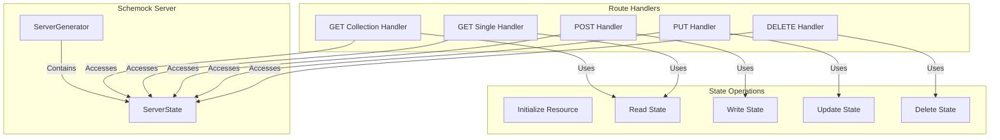
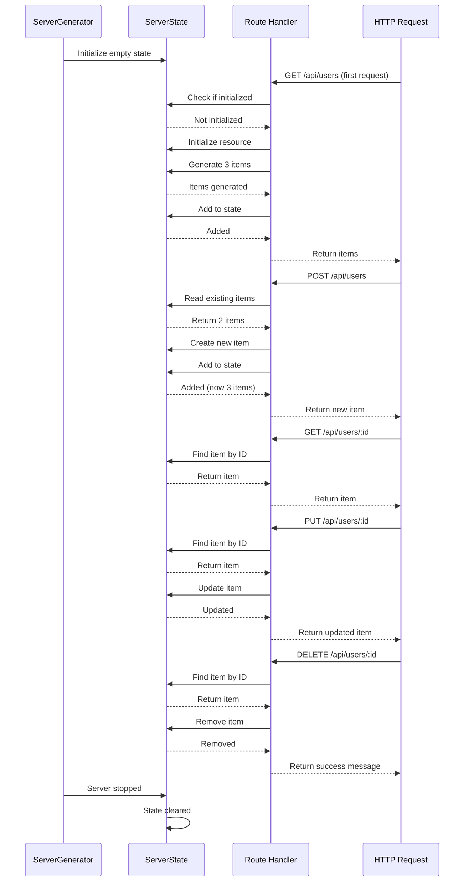
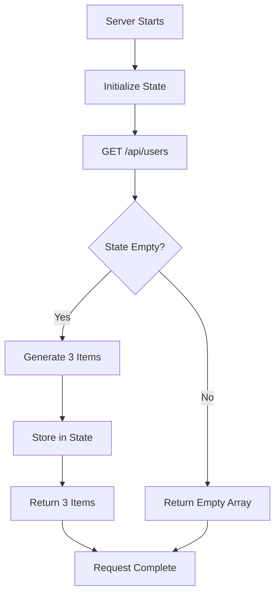
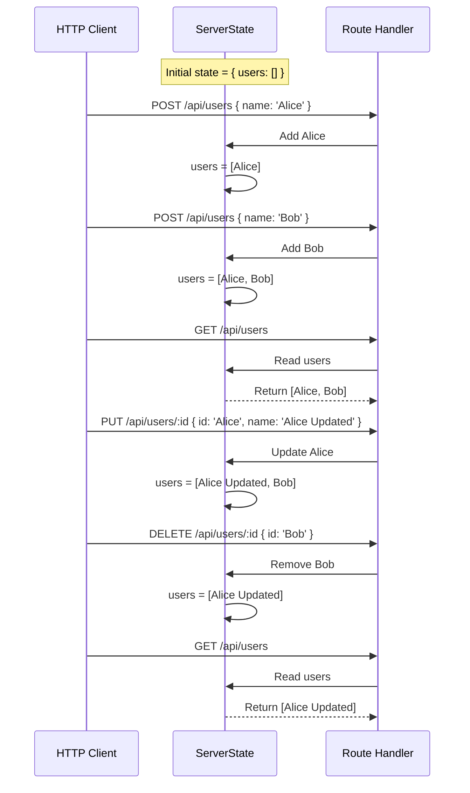

# State Management

This document describes the in-memory state architecture used by Schemock for CRUD operations.

## Table of Contents

- [Overview](#overview)
- [State Architecture](#state-architecture)
- [State Operations](#state-operations)
- [State Initialization](#state-initialization)
- [State Lifecycle](#state-lifecycle)
- [State Persistence](#state-persistence)
- [State Scenarios](#state-scenarios)

## Overview

Schemock uses an **in-memory state management** system to track resources across HTTP requests. This enables:

- **CRUD operations**: Create, Read, Update, Delete
- **Stateful mocking**: Consistent responses across requests
- **Data persistence**: Within server lifecycle only
- **Automatic reset**: State cleared on server restart

### State Architecture Diagram



## State Architecture

### ServerState Type

**Location**: [`src/types/index.ts`](../src/types/index.ts:79)

```typescript
/**
 * Type for server state
 * Maps resource names to arrays of items
 */
export type ServerState = Record<string, JSONValue[]>;
```

**Characteristics**:

| Aspect | Description |
|---------|-------------|
| **In-Memory** | Stored in process memory |
| **Per-Resource** | Each resource has its own array |
| **Type-Safe** | Uses JSONValue[] for flexibility |
| **Mutable** | Can be modified by handlers |
| **Non-Persistent** | Lost on server restart |

### State Storage

**Location**: [`src/generators/server.ts`](../src/generators/server.ts:38)

```typescript
export class ServerGenerator {
  private state: ServerState = {};

  // State is accessible to route handlers via closure
}
```

**State Structure Example**:

```typescript
const state: ServerState = {
  'users': [
    { id: '123e4567-e89b-12d3-a456-426614174000', name: 'John Doe', email: 'john@example.com' },
    { id: '987e6543-e21b-12d3-a456-426614174001', name: 'Jane Smith', email: 'jane@example.com' }
  ],
  'products': [
    { id: 'prod-1', name: 'Product 1', price: 29.99 },
    { id: 'prod-2', name: 'Product 2', price: 49.99 }
  ]
};
```

**ADR-036: In-Memory State Pattern**
**Decision**: Use in-memory state for CRUD operations.

**Rationale**:

- Simplicity for a mock server
- Fast access and manipulation
- No persistence requirements
- Automatic reset on server restart
- No I/O overhead

## State Operations

### State Initialization

**Location**: [`src/generators/schema-routes.ts`](../src/generators/schema-routes.ts:58)

**Purpose**: Initialize state for a resource when first accessed.

**Implementation**:

```typescript
function initializeResourceState(state: ServerState, resource: string): void {
  if (!state[resource]) {
    state[resource] = [];
  }
}
```

**Behavior**:

- Creates empty array if resource doesn't exist
- No-op if resource already initialized
- Called before each state read operation

### State Read Operations

#### Read Collection

**Location**: [`src/generators/schema-routes.ts`](../src/generators/schema-routes.ts:126)

**Purpose**: Retrieve all items for a resource.

**Implementation**:

```typescript
function handleGetCollection(
  state: ServerState,
  resource: string,
  // ... other parameters
): JSONValue {
  // Return list from state
  if (state[resource].length === 0) {
    // Populate with some initial data
    const generated = SchemaParser.parse(responseSchema, mainSchema, new Set(), options.strict, resource);
    if (Array.isArray(generated)) {
      state[resource] = generated;
    } else {
      // Generate 3 items if not array
      for (let i = 0; i < 3; i++) {
        const item = SchemaParser.parse(responseSchema, mainSchema, new Set(), options.strict, resource);
        if (item && typeof item === 'object' && !Array.isArray(item)) {
          const itemObj = item as Record<string, JSONValue>;
          if (!itemObj.id) {
            itemObj.id = uuidv4();
          }
        }
        state[resource].push(item);
      }
    }
  }

  return wrap ? {
    success: true,
    message: 'Mock data retrieved',
    timestamp: new Date().toISOString(),
    data: state[resource],
    meta: { total: state[resource].length }
  } : state[resource];
}
```

**Behavior**:

- Returns empty array if no items exist
- Generates 3 initial items on first request
- Wraps response in success envelope if `wrap=true`
- Includes metadata with total count

#### Read Single Item

**Location**: [`src/generators/schema-routes.ts`](../src/generators/schema-routes.ts:76)

**Purpose**: Retrieve a single item by ID.

**Implementation**:

```typescript
function handleGetById(
  state: ServerState,
  resource: string,
  req: RouteRequest,
  responseSchema: Schema,
  mainSchema: Schema,
  options: { strict?: boolean },
  wrap: boolean
): JSONValue {
  // Find item by ID
  const item = state[resource].find((i: JSONValue) =>
    typeof i === 'object' && i !== null && 'id' in i && i.id === req.params?.id
  );

  if (item) {
    return wrap ? {
      success: true,
      message: 'Mock data retrieved',
      timestamp: new Date().toISOString(),
      data: item
    } : item;
  }

  // Fallback: generate, tie to ID, and store in state for consistency
  let data = SchemaParser.parse(responseSchema, mainSchema, new Set(), options.strict, resource);
  if (data && typeof data === 'object' && !Array.isArray(data) && req.params?.id) {
    const dataObj = data as Record<string, JSONValue>;
    dataObj.id = req.params.id;
    state[resource].push(dataObj);
    data = dataObj;
  }

  return wrap ? {
    success: true,
    message: 'Mock data generated',
    timestamp: new Date().toISOString(),
    data
  } : data;
}
```

**Behavior**:

- Returns existing item if found in state
- Generates new item with requested ID if not found
- Stores generated item in state for consistency
- Wraps response in success envelope if `wrap=true`

### State Write Operations

#### Create Item

**Location**: [`src/generators/schema-routes.ts`](../src/generators/schema-routes.ts:172)

**Purpose**: Add a new item to the resource state.

**Implementation**:

```typescript
function handlePost(
  state: ServerState,
  resource: string,
  req: RouteRequest,
  wrap: boolean
): JSONValue {
  const bodyObj = typeof req.body === 'object' && req.body !== null ? req.body as Record<string, unknown> : {};
  const newItem: Record<string, JSONValue> = {
    id: (bodyObj.id as string) || uuidv4(),
    ...bodyObj as Record<string, JSONValue>,
    createdAt: new Date().toISOString(),
    updatedAt: new Date().toISOString()
  };
  state[resource].push(newItem);

  return wrap ? { success: true, data: newItem, message: 'Created successfully' } : newItem;
}
```

**Behavior**:

- Generates UUID if not provided in body
- Merges request body with timestamps
- Adds item to state collection
- Returns 201 status code (set during route registration)
- Wraps response in success envelope if `wrap=true`

### State Update Operations

#### Update Item

**Location**: [`src/generators/schema-routes.ts`](../src/generators/schema-routes.ts:199)

**Purpose**: Update an existing item in the resource state.

**Implementation**:

```typescript
function handlePut(
  state: ServerState,
  resource: string,
  req: RouteRequest,
  wrap: boolean
): JSONValue {
  const index = state[resource].findIndex((i: JSONValue) =>
    typeof i === 'object' && i !== null && 'id' in i && i.id === req.params?.id
  );

  const bodyObj = typeof req.body === 'object' && req.body !== null ? req.body as Record<string, unknown> : {};
  const existingItem = index >= 0 && typeof state[resource][index] === 'object' && state[resource][index] !== null
    ? state[resource][index] as Record<string, unknown>
    : {};

  const updatedItem: Record<string, JSONValue> = {
    ...(existingItem as Record<string, JSONValue>),
    ...bodyObj as Record<string, JSONValue>,
    id: req.params?.id || '',
    updatedAt: new Date().toISOString()
  };

  if (index >= 0) {
    state[resource][index] = updatedItem;
  } else {
    state[resource].push(updatedItem);
  }

  return wrap ? { success: true, data: updatedItem } : updatedItem;
}
```

**Behavior**:

- Updates existing item if found by ID
- Creates new item if not found (upsert behavior)
- Preserves existing properties not in request body
- Prevents ID change
- Adds updatedAt timestamp
- Returns 200 status code

### State Delete Operations

#### Delete Item

**Location**: [`src/generators/schema-routes.ts`](../src/generators/schema-routes.ts:239)

**Purpose**: Remove an item from the resource state.

**Implementation**:

```typescript
function handleDelete(
  state: ServerState,
  resource: string,
  req: RouteRequest,
  wrap: boolean
): JSONValue {
  state[resource] = state[resource].filter((i: JSONValue) =>
    typeof i === 'object' && i !== null && 'id' in i && i.id !== req.params?.id
  );

  return wrap ? { success: true, message: 'Deleted successfully' } : { message: 'Deleted successfully' };
}
```

**Behavior**:

- Filters out item with matching ID
- Returns 204 status code (set during route registration)
- Wraps response in success envelope if `wrap=true`
- Does not return deleted item

## State Lifecycle



### Lifecycle Phases

| Phase | Description | State Behavior |
|--------|-------------|----------------|
| **Initialization** | Server starts, state is empty | `state = {}` |
| **First Request** | Resource initialized with mock data | `state[resource] = [mock1, mock2, mock3]` |
| **Subsequent Requests** | State persists across requests | Items accumulate |
| **Server Restart** | State is completely reset | `state = {}` |

## State Persistence

### No Persistence Strategy

**Decision**: State is **not persisted** to disk or database.

**Rationale**:

| Aspect | Decision | Reason |
|---------|----------|--------|
| **Simplicity** | No persistence needed | Mock server doesn't need data survival |
| **Performance** | In-memory is fastest | No I/O overhead |
| **Testing** | Clean state per test | Easy to test isolated scenarios |
| **Reset Behavior** | Automatic reset on restart | Expected for mock server |

**ADR-037: No State Persistence**
**Decision**: State is not persisted between server restarts.

**Rationale**:

- Mock server is ephemeral by nature
- Simplifies implementation
- Avoids data consistency issues
- Clearer testing model
- Expected behavior for mocking

### State Isolation

**Per-Server Isolation**: Each `ServerGenerator` instance has its own state.

```typescript
// Server 1
const server1 = createMockServer(schema, { port: 3000 });
// server1.state is independent

// Server 2
const server2 = createMockServer(schema, { port: 3001 });
// server2.state is independent
```

**Per-Request Isolation**: Each request gets a fresh copy of state (via closure).

```typescript
// Route handler receives state as parameter
const handler = (req: RouteRequest, state: ServerState): JSONValue => {
  // state is the same reference for all requests to this route
  // but modifications don't affect other requests
  return state[resource];
};
```

## State Scenarios

### Scenario 1: Empty State



### Scenario 2: CRUD Operations



### Scenario 3: Concurrent Requests

```mermaid
sequenceDiagram
    participant Client1 as Client 1
    participant Client2 as Client 2
    participant Handler as Route Handler
    participant State as ServerState

    Note over State: Initial state = { users: [Alice] }

    par Request 1 and 2
        Client1->>Handler: POST /api/users { name: 'Bob' }
        Client2->>Handler: POST /api/users { name: 'Charlie' }
    end

    Handler->>State: Add Bob
    State->>State: users = [Alice, Bob]

    Handler-->>Client1: Return [Alice, Bob]

    Handler->>State: Add Charlie
    State->>State: users = [Alice, Bob, Charlie]

    Handler-->>Client2: Return [Alice, Bob, Charlie]
    end
```

**Concurrency Considerations**:

| Aspect | Behavior | Notes |
|---------|----------|-------|
| **Read Safety** | Array operations are atomic | JavaScript array operations are safe |
| **Write Safety** | Push operations are atomic | No race conditions in single-threaded Node.js |
| **Consistency** | Each request sees consistent state | Within single request, state is stable |
| **Isolation** | Multiple servers have independent state | No cross-server state sharing |

### Scenario 4: Server Restart

```mermaid
flowchart TD
    Start[Server Running] --> State1[State: users = [Alice, Bob]]
    State1 --> Request1[POST /api/users { name: 'Charlie' }]
    Request1 --> State2[State: users = [Alice, Bob, Charlie]]

    State2 --> Stop[Server Stopped]
    Stop --> Clear[State Cleared]
    Clear --> Restart[Server Restarted]
    Restart --> State3[State: users = []]

    State3 --> Request2[GET /api/users]
    Request2 --> Generate[Generate 3 New Items]
    Generate --> State4[State: users = [New1, New2, New3]]
```

**ADR-038: State Reset on Restart**
**Decision**: State is completely reset when server restarts.

**Rationale**:

- Clean state for new server lifecycle
- Prevents stale data issues
- Expected behavior for mock server
- Simpler implementation

## State Management Best Practices

### 1. Initialize Before Use

```typescript
function handleGetCollection(state: ServerState, resource: string, ...): JSONValue {
  // Always initialize before reading
  initializeResourceState(state, resource);

  // Now safe to read
  return state[resource];
}
```

### 2. Immutability for Reads

```typescript
// Good: Return state reference (efficient)
function handleGetCollection(state: ServerState, resource: string): JSONValue {
  return state[resource]; // Reference is fine for read-only
}

// Bad: Create copy (unnecessary)
function handleGetCollectionBad(state: ServerState, resource: string): JSONValue {
  return [...state[resource]]; // Unnecessary copy
}
```

### 3. Atomic Operations

```typescript
// Array operations are atomic in JavaScript
state[resource].push(newItem); // Atomic
state[resource] = state[resource].filter(...); // Atomic
```

### 4. Type Safety

```typescript
// Use JSONValue[] for flexible item types
const state: ServerState = {
  users: JSONValue[] // Can hold any JSONValue
};

// Type guards for runtime safety
if (Array.isArray(state.users)) {
  state.users.forEach((item: JSONValue) => {
    if (typeof item === 'object' && item !== null) {
      const obj = item as Record<string, JSONValue>;
      // Safe to access obj.id
    }
  });
}
```

### 5. Error Handling

```typescript
function handlePost(state: ServerState, resource: string, req: RouteRequest, wrap: boolean): JSONValue {
  try {
    const newItem = createNewItem(req.body);
    state[resource].push(newItem); // Might throw
    return wrap ? { success: true, data: newItem } : newItem;
  } catch (error) {
    // State remains consistent
    throw error; // Let error handler deal with it
  }
}
```

---

**Related Documents**:

- [System Overview](./01-system-overview.md) - High-level architecture
- [Component Architecture](./02-component-architecture.md) - Component details
- [Route Management](./06-route-management.md) - Route handling
- [Data Flow](./03-data-flow.md) - Request lifecycle

**Last Updated**: 2026-01-09
