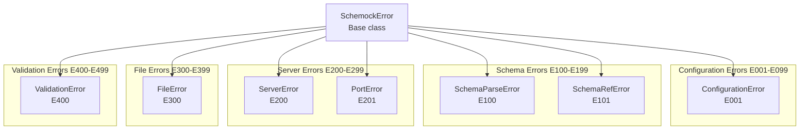

# Error Handling

This document describes the error handling strategy in Schemock, including error types, handling mechanisms, and recovery procedures.

## Table of Contents

- [Overview](#overview)
- [Error Hierarchy](#error-hierarchy)
- [Error Types](#error-types)
- [Error Handling Flow](#error-handling-flow)
- [Validation Errors](#validation-errors)
- [Runtime Errors](#runtime-errors)
- [Error Recovery](#error-recovery)
- [Error Logging](#error-logging)

## Overview

Schemock implements a comprehensive error handling strategy that provides:

- **Type-safe errors**: Custom error classes with error codes
- **Helpful messages**: Clear error descriptions with hints
- **Proper HTTP responses**: Appropriate status codes for different error types
- **Structured logging**: Consistent error logging with context
- **Graceful degradation**: System continues despite errors where possible

### Error Handling Architecture

```mermaid
graph TB
    subgraph "Error Sources"
        Validation[Input Validation]
        FileIO[File I/O]
        Schema[Schema Parsing]
        Server[Server Operations]
        Network[Network Operations]
    end

    subgraph "Error Classes"
        ConfigError[ConfigurationError]
        SchemaError[SchemaParseError]
        RefError[SchemaRefError]
        SrvError[ServerError]
        PortError[PortError]
        FileError[FileError]
        ValidationError[ValidationError]
    end

    subgraph "Error Handling"
        Formatter[Error Formatter]
        Logger[Structured Logger]
        Middleware[Error Handler Middleware]
    end

    Validation -->|Throws| ConfigError
    Validation -->|Throws| ValidationError
    FileIO -->|Throws| FileError
    Schema -->|Throws| SchemaError
    Schema -->|Throws| RefError
    Server -->|Throws| SrvError
    Server -->|Throws| PortError

    All Errors -->|Uses| Formatter
    Formatter -->|Uses| Logger
    Logger -->|Uses| Middleware

    Middleware -->|Returns| HTTP Response
```

## Error Hierarchy

**Location**: [`src/errors/index.ts`](../src/errors/index.ts:1)

### Base Error Class

```typescript
export class SchemockError extends Error {
  constructor(
    message: string,
    public code: string,
    public details?: any,
    public hint?: string
  ) {
    super(message);
    this.name = 'SchemockError';
    Error.captureStackTrace(this, this.constructor);
  }
}
```

**Properties**:

| Property | Type | Description |
|----------|------|-------------|
| `message` | string | Human-readable error message |
| `code` | string | Unique error code for identification |
| `details` | any | Additional error context/data |
| `hint` | string | Helpful hint for resolving the error |
| `stack` | string | Stack trace (from Error) |

### Error Class Hierarchy



### Error Code Ranges

| Range | Code | Class | Description |
|-------|------|-------|-------------|
| E001-E099 | `E001` | Configuration errors |
| E100-E199 | `E100`, `E101` | Schema parsing errors |
| E200-E299 | `E200`, `E201` | Server errors |
| E300-E399 | `E300` | File I/O errors |
| E400-E499 | `E400` | Validation errors |

## Error Types

### ConfigurationError

**Code**: `E001`

**Location**: [`src/errors/index.ts`](../src/errors/index.ts:29)

**Purpose**: Errors related to CLI arguments or configuration files.

**Thrown By**:

- [`src/cli/index.ts`](../src/cli/index.ts) - Invalid CLI arguments
- [`src/utils/config.ts`](../src/utils/config.ts) - Configuration validation failures

**Example**:

```typescript
throw new ConfigurationError(
  'Server options validation failed',
  { port: 70000, field: 'server.port' },
  'Check your CLI arguments or configuration file.'
);
```

**Error Response Format**:

```json
{
  "code": "E001",
  "message": "Server options validation failed",
  "details": {
    "port": 70000,
    "field": "server.port"
  },
  "hint": "Check your CLI arguments or configuration file."
}
```

### SchemaParseError

**Code**: `E100`

**Location**: [`src/errors/index.ts`](../src/errors/index.ts:45)

**Purpose**: Errors when a JSON Schema cannot be parsed or is invalid.

**Thrown By**:

- [`src/parsers/schema.ts`](../src/parsers/schema.ts) - Schema parsing failures

**Example**:

```typescript
throw new SchemaParseError(
  'Schema is required',
  undefined,
  'Ensure your schema follows JSON Schema Draft 7 specifications.'
);
```

### SchemaRefError

**Code**: `E101`

**Location**: [`src/errors/index.ts`](../src/errors/index.ts:61)

**Purpose**: Errors when a `$ref` in a JSON Schema cannot be resolved.

**Thrown By**:

- [`src/parsers/schema.ts`](../src/parsers/schema.ts) - Reference resolution failures

**Example**:

```typescript
throw new SchemaRefError(
  `Cannot resolve $ref: ${ref}. Path not found: ${part}`,
  ref,
  'Verify that referenced definition exists in your schema.'
);
```

### ServerError

**Code**: `E200`

**Location**: [`src/errors/index.ts`](../src/errors/index.ts:77)

**Purpose**: Errors when mock server encounters issues starting or running.

**Thrown By**:

- [`src/generators/server.ts`](../src/generators/server.ts) - Server startup failures

**Example**:

```typescript
throw new ServerError(
  'Failed to start server',
  { originalError: err },
  'Check if another process is using the same port or if you have necessary permissions.'
);
```

### PortError

**Code**: `E201`

**Location**: [`src/errors/index.ts`](../src/errors/index.ts:93)

**Purpose**: Errors when the specified port is already in use or invalid.

**Thrown By**:

- [`src/generators/server.ts`](../src/generators/server.ts) - Port binding failures
- [`src/utils/validation.ts`](../src/utils/validation.ts) - Port validation failures

**Example**:

```typescript
throw new PortError(
  `Port ${port} is already in use`,
  port,
  `Port ${port} is already in use. Try starting with a different port using --port <number>.`
);
```

### FileError

**Code**: `E300`

**Location**: [`src/errors/index.ts`](../src/errors/index.ts:110)

**Purpose**: Errors when file operations fail due to missing files or permission issues.

**Thrown By**:

- [`src/cli/index.ts`](../src/cli/index.ts) - File reading failures
- [`src/utils/validation.ts`](../src/utils/validation.ts) - File validation failures
- [`src/utils/watcher.ts`](../src/utils/watcher.ts) - File watching errors

**Example**:

```typescript
throw new FileError(
  `${ERROR_MESSAGES.FILE_NOT_FOUND}: ${filePath}`,
  filePath,
  'read',
  'Make sure the file at ${filePath} exists and is readable.'
);
```

### ValidationError

**Code**: `E400`

**Location**: [`src/errors/index.ts`](../src/errors/index.ts:127)

**Purpose**: Errors when data or configuration fails validation against a schema.

**Thrown By**:

- [`src/utils/validation.ts`](../src/utils/validation.ts) - Data validation failures
- [`src/generators/server.ts`](../src/generators/server.ts) - Request validation failures (strict mode)

**Example**:

```typescript
throw new ValidationError(
  `${ERROR_MESSAGES.MISSING_REQUIRED_FIELD}: ${field}`,
  field,
  undefined,
  `Field '${field}' is required in schema but was not provided in data.`
);
```

## Error Handling Flow

### Error Detection and Handling

```mermaid
flowchart TD
    Start[Incoming Request] --> Validate{Validate Input?}
    Validate -->|Fail| ThrowError[Throw ValidationError]
    Validate -->|Pass| Process[Process Request]

    Process --> CheckScenario{Scenario Mode?}
    CheckScenario -->|Error| ScenarioError[Inject Error]
    CheckScenario -->|Normal| Generate[Generate Response]

    ScenarioError -->|ReturnError[Return Error Response]
    Generate -->|ReturnSuccess[Return Success Response]

    alt Error in Handler
        Process -->|Catch| LogError[Log Error]
        LogError -->|ReturnError
    else Success
        Process -->|NoError| ReturnSuccess
    end
```

### Middleware Error Handling

**Location**: [`src/generators/middleware.ts`](../src/generators/middleware.ts:73)

```typescript
export function setupErrorHandler(app: Application, logLevel?: string): void {
  app.use((err: Error, req: Request, res: Response, next: NextFunction) => {
    log.error('Request error', {
      module: 'server',
      error: err,
      method: req.method,
      path: req.path
    });

    res.status(500).json({
      error: 'Internal Server Error',
      message: logLevel === 'debug' ? err.message : 'An error occurred'
    });
  });
}
```

**Error Response Format**:

```json
{
  "error": "Internal Server Error",
  "message": "An error occurred"
}
```

**Debug Mode Response**:

```json
{
  "error": "Internal Server Error",
  "message": "Detailed error message here"
}
```

### Route Handler Error Handling

**Location**: [`src/generators/server.ts`](../src/generators/server.ts:106)

```typescript
const routeHandler = async (req: Request, res: Response, next: NextFunction) => {
  const startTime = Date.now();
  const scenario = this.config.server.scenario;

  try {
    // Apply delay if specified or if scenario is slow
    let effectiveDelay = delay;
    if (scenario === 'slow' || scenario === 'sad-path') {
      effectiveDelay += 1000 + Math.random() * 2000;
    }

    if (effectiveDelay > 0) {
      await new Promise(resolve => setTimeout(resolve, effectiveDelay));
    }

    // Apply errors if scenario is error-heavy
    if (scenario === 'error-heavy' || scenario === 'sad-path') {
      if (Math.random() < 0.3) {
        const errorStatus = [400, 401, 403, 404, 500, 503][Math.floor(Math.random() * 6)];
        log.warn(`Scenario ${scenario} triggered error`, {
          module: 'server',
          path,
          method,
          statusCode: errorStatus
        });
        return res.status(errorStatus).json({
          success: false,
          error: 'ScenarioError',
          message: `This error was generated by the '${scenario}' preset scenario.`,
          statusCode: errorStatus
        });
      }
    }

    // Set response headers
    Object.entries(headers).forEach(([key, value]) => {
      res.setHeader(key, value);
    });

    // Request validation for strict mode
    if (this.config.server.strict && ['POST', 'PUT', 'PATCH'].includes(req.method)) {
      if (schema) {
        try {
          validateData(req.body, schema);
        } catch (error: unknown) {
          if (error instanceof ValidationError) {
            log.warn('Request validation failed (strict mode)', {
              module: 'server',
              path,
              method,
              error: error.message
            });
            return res.status(400).json({
              success: false,
              error: 'ValidationError',
              message: `Request validation failed: ${error.message}`,
              details: error.details
            });
          }
          throw error;
        }
      }
    }

    // Handle different response types
    if (typeof response === 'function') {
      const routeReq: RouteRequest = {
        params: req.params as Record<string, string> | undefined,
        query: req.query,
        body: req.body,
        method: req.method,
        path: req.path,
        headers: req.headers as Record<string, string>
      };
      const result = await Promise.resolve(response(routeReq, this.state));
      const brandedResult = addBranding(result, this.config.server.hideBranding ?? false, this.version);
      res.status(statusCode).json(brandedResult);
    } else if (typeof response === 'object' && response !== null) {
      const brandedResponse = addBranding(response, this.config.server.hideBranding ?? false, this.version);
      res.status(statusCode).json(brandedResponse);
    } else {
      res.status(statusCode).send(response);
    }

    const duration = Date.now() - startTime;
    log.debug('Route handler completed', {
      module: 'server',
      path,
      method,
      duration,
      scenario: scenario || 'default'
    });
  } catch (error) {
    next(error);
  }
};
```

## Validation Errors

### Port Validation

**Location**: [`src/utils/validation.ts`](../src/utils/validation.ts:27)

**Validation Rules**:

| Rule | Description | Error Code |
|-------|-------------|------------|
| Must be integer | Rejects floats | `E400` |
| Must be 1-65535 | Rejects out of range | `E400` |
| Warn if privileged (<1024) on Unix | Logs warning | None |
| Must be numeric string or number | Rejects non-numeric | `E400` |

**Implementation**:

```typescript
export function validatePort(port: string | number): number {
  // Reject non-numeric types
  if (typeof port !== 'string' && typeof port !== 'number') {
    throw new ValidationError('Port must be a string or number', 'port', typeof port);
  }

  const portNum = typeof port === 'string' ? parseInt(port, 10) : port;

  // Reject NaN
  if (isNaN(portNum) || !isFinite(portNum)) {
    throw new ValidationError('Port must be a valid number', 'port', port);
  }

  // Reject floats
  if (!Number.isInteger(portNum)) {
    throw new ValidationError('Port must be an integer', 'port', port);
  }

  // Reject out of range
  if (portNum < MIN_PORT || portNum > MAX_PORT) {
    throw new ValidationError(
      `Port must be between ${MIN_PORT} and ${MAX_PORT}`,
      'port',
      portNum
    );
  }

  // Warn about privileged ports
  if (portNum < PRIVILEGED_PORT_THRESHOLD && process.platform !== 'win32') {
    log.warn(`${ERROR_MESSAGES.PORT_REQUIRES_ELEVATED_PRIVILEGES}: ${portNum}`, {
      module: 'validation',
      port: portNum,
      platform: process.platform
    });
  }

  return portNum;
}
```

### Schema Validation

**Location**: [`src/utils/validation.ts`](../src/utils/validation.ts:157)

**Validation Rules**:

| Rule | Description | Strict Mode |
|-------|-------------|------------|
| Must be object | Rejects non-objects | Always |
| Must have type or composition | Rejects empty schemas | Always |
| Object must have properties if type=object | Rejects empty objects | Strict only |
| Array must have items if type=array | Rejects empty arrays | Strict only |
| Required fields must exist | Warns if missing | Always |

**Implementation**:

```typescript
export function validateSchema(schema: any, strict: boolean = false): void {
  // Check if schema is valid object
  if (!schema || typeof schema !== 'object' || Array.isArray(schema)) {
    throw new ValidationError(
      ERROR_MESSAGES.SCHEMA_MUST_BE_OBJECT,
      'schema',
      schema,
      'Check if your JSON file contains a single root object { ... }.'
    );
  }

  // Check for type or composition keywords
  if (!schema.type && !schema.$ref && !schema.oneOf && !schema.anyOf && !schema.allOf) {
    throw new ValidationError(
      ERROR_MESSAGES.SCHEMA_MUST_HAVE_TYPE_OR_COMPOSITION,
      'schema',
      schema,
      'Add "type": "object" or similar to your root schema.'
    );
  }

  // Validate type if present
  if (schema.type) {
    const validTypes = ['string', 'number', 'integer', 'boolean', 'object', 'array', 'null'];
    const types = Array.isArray(schema.type) ? schema.type : [schema.type];

    for (const type of types) {
      if (!validTypes.includes(type)) {
        throw new ValidationError(
          `${ERROR_MESSAGES.INVALID_SCHEMA_TYPE}: ${type}. Must be one of: ${validTypes.join(', ')}`,
          'type',
          type
        );
      }
    }
  }

  // Strict mode checks
  if (strict) {
    if (schema.type === 'object' && !schema.properties && !schema.additionalProperties && !schema.$ref && !schema.oneOf && !schema.anyOf && !schema.allOf) {
      throw new ValidationError(
        'Strict mode: object schema must define properties or additionalProperties',
        'properties',
        undefined,
        'In strict mode, objects must explicitly list their allowed properties.'
      );
    }

    if (schema.type === 'array' && !schema.items) {
      throw new ValidationError(
        'Strict mode: array schema must define items',
        'items',
        undefined,
        'In strict mode, arrays must define what kind of items they contain.'
      );
    }
  }

  // Recursively validate properties
  if (schema.properties && typeof schema.properties === 'object') {
    for (const [prop, propSchema] of Object.entries(schema.properties)) {
      try {
        validateSchema(propSchema, strict);
      } catch (error: any) {
        if (error instanceof ValidationError) {
          throw new ValidationError(
            error.message,
            `properties.${prop}${error.details.field !== 'schema' ? '.' + error.details.field : ''}`,
            error.details.value,
            error.hint
          );
        }
        throw error;
      }
    }
  }
}
```

### File Path Validation

**Location**: [`src/utils/validation.ts`](../src/utils/validation.ts:75)

**Validation Rules**:

| Rule | Description |
|-------|-------------|
| Reject null bytes | Prevents injection attacks |
| Reject absolute paths | Prevents directory traversal |
| Reject dangerous patterns | Prevents prototype pollution |
| Reject executable extensions | Security risk mitigation |
| Must be within base directory | Optional restriction |

**Implementation**:

```typescript
export function validateFilePath(filePath: string, baseDir?: string): string {
  // Check for null bytes
  if (!filePath || typeof filePath !== 'string') {
    throw new ValidationError('File path must be a non-empty string', 'filePath', filePath);
  }

  // Remove null bytes
  if (filePath.includes('\0')) {
    throw new ValidationError('File path contains invalid null bytes', 'filePath', filePath);
  }

  // Reject absolute paths
  if (isAbsolute(filePath)) {
    throw new ValidationError(
      'Absolute paths are not allowed for security reasons',
      'filePath',
      filePath
    );
  }

  // Check for dangerous patterns BEFORE normalization
  for (const pattern of DANGEROUS_PATH_PATTERNS) {
    if (filePath.includes(pattern)) {
      throw new ValidationError(
        `File path contains disallowed pattern: ${pattern}`,
        'filePath',
        filePath
      );
    }
  }

  // Check for executable file extensions
  const lowerPath = filePath.toLowerCase();
  for (const ext of EXECUTABLE_EXTENSIONS) {
    if (lowerPath.endsWith(ext) || lowerPath.includes(ext + '.')) {
      throw new ValidationError(
        `File path contains executable extension: ${ext}`,
        'filePath',
        filePath
      );
    }
  }

  // Normalize and resolve to absolute path
  const absolutePath = resolve(process.cwd(), filePath);

  // If baseDir specified, ensure path is within it
  if (baseDir) {
    const normalizedBase = normalize(resolve(baseDir));
    if (!absolutePath.startsWith(normalizedBase)) {
      throw new ValidationError(
        'File path attempts to access files outside allowed directory',
        'filePath',
        filePath
      );
    }
  }

  return absolutePath;
}
```

## Runtime Errors

### Server Startup Errors

**Location**: [`src/generators/server.ts`](../src/generators/server.ts:293)

**Error Types**:

| Error | Code | HTTP Status | Description |
|-------|------|-------------|------------|
| Port in use | `E201` | N/A | Server cannot bind to port |
| Permission denied | `E200` | N/A | Insufficient permissions |
| Invalid configuration | `E001` | N/A | Configuration validation failed |

**Error Handling**:

```typescript
this.server = this.app.listen(port, () => {
  log.info(`Mock server started`, {
    module: 'server',
    port,
    url: `http://localhost:${port}`
  });

  if (this.config.server.logLevel === 'debug') {
    log.debug('Available routes:', {
      module: 'server',
      routes: Object.entries(this.config.routes).map(([path, config]) =>
        `${config.method.toUpperCase()} ${path}`
      )
    });
  }

  resolve();
});

this.server.on('error', (error: NodeJS.ErrnoException) => {
  if (error.code === 'EADDRINUSE') {
    const portError = new PortError(`Port ${port} is already in use`, port);
    log.error('Failed to start server', {
      module: 'server',
      error: portError,
      port
    });
    reject(portError);
  } else {
    const serverError = new ServerError(error.message, { originalError: error });
    log.error('Server error', {
      module: 'server',
      error: serverError,
      port
    });
    reject(serverError);
  }
});
```

### Request Processing Errors

**Location**: [`src/generators/server.ts`](../src/generators/server.ts:206)

**Error Types**:

| Error | Code | HTTP Status | Description |
|-------|------|-------------|------------|
| Invalid JSON body | `E400` | 400 | Malformed request body |
| Schema validation failed | `E400` | 400 | Request doesn't match schema |
| Handler error | `E200` | 500 | Unhandled exception in handler |

**Error Handling**:

```typescript
try {
  // Process request
  // ... request handling logic
} catch (error) {
  next(error); // Pass to error handler middleware
}
```

## Error Recovery

### Graceful Degradation

**Strategy**: Continue operating despite non-critical errors.

| Error Type | Recovery Strategy | Example |
|-----------|-----------------|---------|
| **Invalid request body** | Return 400 Bad Request | Don't crash, respond with error |
| **Schema validation failed** | Return 400 with details | Provide helpful hints |
| **Route not found** | Return 404 Not Found | Handle in error middleware |
| **Handler error** | Return 500 Internal Error | Log and continue |
| **Port in use** | Reject startup | Provide helpful message |

### Error Bubbling

```mermaid
flowchart TD
    Start[Error Occurs] --> CheckHandler{Has Error Handler?}
    CheckHandler -->|Yes| PassToNext[Pass to next()]
    CheckHandler -->|No| CheckMiddleware{Has Middleware?}
    PassToNext --> CheckMiddleware
    CheckMiddleware -->|Yes| HandleInMiddleware[Handle in middleware]
    CheckMiddleware -->|No| Crash[Process crashes]

    HandleInMiddleware --> SendResponse[Send error response]
    SendResponse --> End[Request complete]
    Crash --> Terminate[Process terminates]
```

### State Recovery

**Strategy**: Maintain consistent state even after errors.

| Scenario | State Behavior | Notes |
|-----------|---------------|-------|
| **POST fails** | State unchanged | Item not added |
| **PUT fails** | State unchanged | Item not updated |
| **DELETE fails** | State unchanged | Item not removed |
| **Handler throws** | State unchanged | Partial rollback |

**ADR-039: Error Isolation**
**Decision**: Errors don't corrupt global state.

**Rationale**:

- State remains consistent on errors
- No partial updates
- Easier to reason about state
- Cleaner error handling

## Error Logging

### Structured Logging

**Location**: [`src/utils/logger.ts`](../src/utils/logger.ts:91)

**Log Format**:

```typescript
{
  "timestamp": "2026-01-09T05:00:00.000Z",
  "level": "ERROR",
  "message": "Request error",
  "module": "server",
  "error": {
    "message": "Detailed error message",
    "stack": "Error stack trace"
  },
  "method": "GET",
  "path": "/api/users"
}
```

**Log Levels**:

| Level | When Logged | Example |
|-------|-------------|---------|
| `error` | All errors | Server startup failures, request errors |
| `warn` | Warnings and 4xx responses | Port warnings, validation failures |
| `info` | General information | Server started, routes registered |
| `debug` | Detailed information | Request details, timing |

### Error Context

```typescript
log.error('Request error', {
  module: 'server',
  error: err,
  method: req.method,
  path: req.path
});
```

**Context Fields**:

| Field | Description | Example |
|--------|-------------|---------|
| `module` | Component where error occurred | `server`, `cli`, `parser` |
| `error` | Error object with stack trace | Full error object |
| `method` | HTTP method | `GET`, `POST`, `PUT` |
| `path` | Request path | `/api/users`, `/api/users/:id` |

## Error Formatting

### Error Formatter

**Location**: [`src/errors/index.ts`](../src/errors/index.ts:142)

**Purpose**: Formats error messages for display with helpful hints.

**Implementation**:

```typescript
export function formatError(error: Error): string {
  if (error instanceof SchemockError) {
    let message = `[${error.code}] ${error.message}`;

    if (error.hint) {
      message += `\n\n💡 Hint: ${error.hint}`;
    }

    if (error.details && Object.keys(error.details).length > 0) {
      message += `\n\nDetails:\n${JSON.stringify(error.details, null, 2)}`;
    }

    // Legacy suggestions (kept for backward compatibility)
    if (error instanceof PortError && error.details.port) {
      message += `\n\nAdditional Suggestions:\n- On Windows: netstat -ano | findstr :${error.details.port}\n- On macOS/Linux: lsof -i :${error.details.port}`;
    }

    return message;
  }

  return error.message;
}
```

**Formatted Error Example**:

```
[E001] Server options validation failed

💡 Hint: Check your CLI arguments or configuration file.

Details:
{
  "port": 70000,
  "field": "server.port"
}

Additional Suggestions:
- On Windows: netstat -ano | findstr :3000
- On macOS/Linux: lsof -i :3000
```

---

**Related Documents**:

- [System Overview](./01-system-overview.md) - High-level architecture
- [Component Architecture](./02-component-architecture.md) - Component details
- [Design Patterns](./04-design-patterns.md) - Patterns used
- [Data Flow](./03-data-flow.md) - Request lifecycle

**Last Updated**: 2026-01-09
