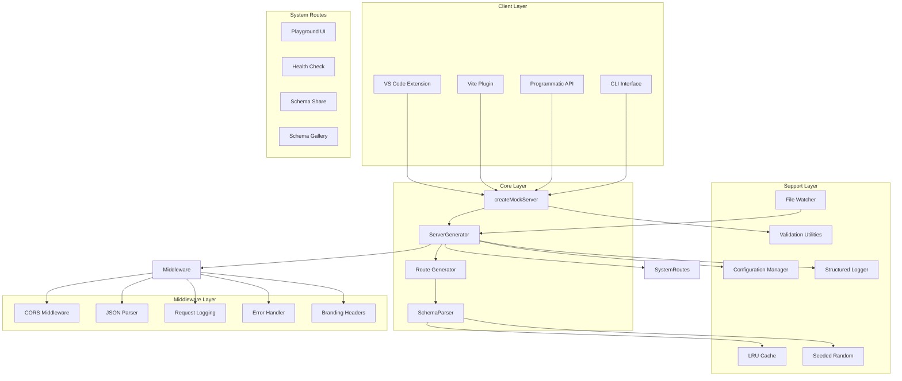

# Schemock Architecture Documentation

This directory contains comprehensive architecture documentation for the Schemock project. These documents provide in-depth technical details about the system design, component interactions, data flow, and implementation decisions.

## Overview

Schemock is a lightweight mock server generator that creates RESTful API endpoints from JSON Schema definitions. Built with TypeScript and Node.js, it provides developers with a powerful tool for rapid prototyping and testing of client applications without requiring backend implementation.

## Architecture Documents

### High Priority (Must Have)

| Document | Description | Status |
|-----------|-------------|--------|
| [01-system-overview.md](./01-system-overview.md) | High-level system architecture with Mermaid diagrams | ✅ |
| [02-component-architecture.md](./02-component-architecture.md) | Detailed component breakdown and responsibilities | ✅ |
| [03-data-flow.md](./03-data-flow.md) | Complete data flow diagrams and request lifecycle | ✅ |

### Medium Priority (Should Have)

| Document | Description | Status |
|-----------|-------------|--------|
| [04-design-patterns.md](./04-design-patterns.md) | Design patterns used throughout the codebase | ✅ |
| [05-middleware-layer.md](./05-middleware-layer.md) | Middleware architecture and pipeline | ✅ |
| [06-route-management.md](./06-route-management.md) | Route generation and handling strategies | ✅ |

### Low Priority (Nice to Have)

| Document | Description | Status |
|-----------|-------------|--------|
| [07-integrations.md](./07-integrations.md) | Vite, VS Code, and installer integrations | ✅ |
| [08-state-management.md](./08-state-management.md) | In-memory state architecture | ✅ |
| [09-error-handling.md](./09-error-handling.md) | Error handling strategy and custom errors | ✅ |

## System Architecture Diagram

## Key Architectural Principles

### 1. Separation of Concerns

Each component has a single, well-defined responsibility:

- **ServerGenerator**: Manages server lifecycle and route registration
- **SchemaParser**: Generates mock data from JSON Schema
- **RouteGenerator**: Creates route configurations from schemas
- **Middleware**: Handles cross-cutting concerns (CORS, logging, errors)

### 2. Configuration-Driven Design

All behavior is driven by configuration objects:

- `ServerOptions`: Server-level configuration
- `RouteConfig`: Individual route configuration
- `MockServerConfig`: Complete server configuration

### 3. Extensibility Through Patterns

Multiple design patterns enable easy extension:

- **Factory Pattern**: Route handler creation
- **Strategy Pattern**: Different response types (static, dynamic, schema-based)
- **Observer Pattern**: File watching events
- **Builder Pattern**: Configuration building

### 4. Performance Optimization

- **LRU Caching**: Schema parsing results cached for reuse
- **Lazy Generation**: Mock data generated on-demand per request
- **Connection Tracking**: Graceful shutdown with connection cleanup

### 5. Security Considerations

- **Input Validation**: All user inputs validated
- **Prototype Pollution Prevention**: Safe merge implementation
- **Path Sanitization**: Directory traversal attack prevention
- **Executable Extension Blocking**: Security risk mitigation

## Technology Stack

| Layer | Technology | Purpose |
|--------|-------------|---------|
| Runtime | Node.js 18+ | JavaScript runtime |
| Language | TypeScript 5.x | Type safety and compilation |
| Web Framework | Express.js | HTTP server and routing |
| CLI Framework | Commander.js | Command-line interface |
| File Watching | Chokidar | Schema hot-reload |
| Testing | Jest | Unit and integration tests |
| Build Tool | TypeScript Compiler | Compilation to JavaScript |

## Related Documentation

- [API Documentation](../api/api-documentation.md) - Complete API reference
- [Technical Specifications](../technical/technical-specifications.md) - Technical details
- [User Guide](../user/user-guide.md) - End-user documentation
- [Development Guide](../development/build-guide.md) - Contributor guide

## Architectural Decision Records (ADRs)

Key design decisions and their rationale:

### ADR-001: Express.js as Web Framework

**Decision**: Use Express.js as the HTTP server framework

**Rationale**:

- Mature and widely adopted ecosystem
- Extensive middleware support
- Well-documented and maintained
- Lightweight and performant

**Alternatives Considered**:

- Fastify: Better performance but smaller ecosystem
- Koa: More modern but steeper learning curve
- Hapi: More features but heavier weight

### ADR-002: In-Memory State Management

**Decision**: Use in-memory state for CRUD operations

**Rationale**:

- Simplicity for a mock server
- No persistence requirements
- Fast access and manipulation
- Automatic reset on server restart

**Alternatives Considered**:

- SQLite: Adds complexity and file I/O
- Redis: Overkill for mock data
- File-based: Slower and more complex

### ADR-003: LRU Cache for Schema Parsing

**Decision**: Implement LRU cache for parsed schema results

**Rationale**:

- Repeated schema parsing is expensive
- Most schemas are reused across requests
- LRU automatically evicts least-used entries
- Configurable TTL for freshness

**Alternatives Considered**:

- No caching: Simpler but slower
- Infinite cache: Memory leak risk
- Time-based only: Doesn't account for usage patterns

### ADR-004: Seeded Random Generator

**Decision**: Implement seeded random number generator

**Rationale**:

- Reproducible test results
- Consistent mock data generation
- Fallback to Math.random() for production
- No external dependencies

**Alternatives Considered**:

- Math.random() only: Non-deterministic
- crypto.randomBytes(): Too slow, no seeding
- External libraries: Adds dependency weight

---

**Last Updated**: 2026-01-09
